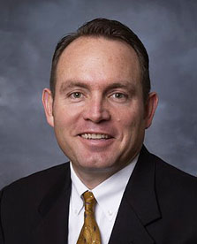
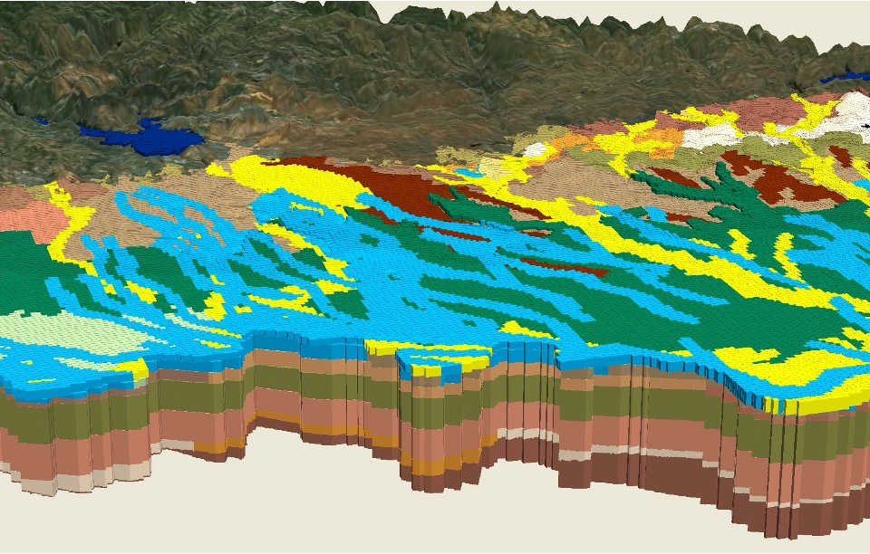

# BYU CE 547 - Groundwater Modeling

	

		
	

	

		<h2>Norm Jones</h2>
		
430T Engineering Building 
		<a href="mailto:njones@byu.edu">njones@byu.edu</a> 
		801-422-7569 (office) 
		<strong>Lectures</strong>: 234CB 9:30 - 10:45 am T-Th

        
&nbsp;

	

Welcome to the content repository for **CE 547 - Groundwater Modeling**. This repository contains the homework assignments and exercises associated with the class. The content is organized by unit and category and can be browsed using the navigation bar on the left. You can also access this content from the Schedule page on the BYU Learning Suite page for the class.  The schedule will contain links to the content for each unit and category. This content is maintained by the Prof. Jones and TAs and is subject to change. If you have any questions, comments, or suggestions, please contact Prof. Jones.

{width=900px}

Brigham Young University - Dept. of Civil and Construction Engineering
