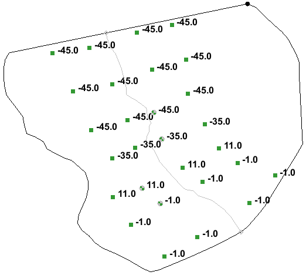

# Term Project

The term project will involve building a groundwater model of the Woburn site described in the book A Civil Action. We will divide the class into eight groups. Each group will build a MODFLOW model of the site and perform a particle tracking analysis. Two groups will represent Beatrice, two groups will represent the plaintiffs against Beatrice, two groups will represent W.R. Grace, and the final two groups will represent the plaintiffs against W.R. Grace. We will focus on one primary issue: flow paths and travel times. Using MODFLOW and MODPATH each group will attempt to prove or disprove that the hydraulic conditions were such that any TCE dumped at the sites could have reached the municipal water wells within the target time frame. At the end of the semester, each group will submit a written report and we will spend three days making presentations and debating the merits of each model.

## Time Issues

The main focus of this project is to address the travel time issue. Using your model, you should be answering the question of whether or not TCE could have traveled from the W.R. Grace or Beatrice facility to wells G&H within the time frame addressed by the court trial. Consider the following comment regarding the jury instructions from Judge Skinner:

>>_"First: Had the plaintiffs established by a preponderance of the evidence that any of the following chemicals - TCE, perc, adn 1,2 transdichloroethylene - were disposed on the Beatrice land after August 27, 1968 (in the case of W.R. Grace, after October 1, 1964, and the date Well G had opened), and had these chemicals substantially contributed to the contamination of the wells before May 22, 1979? If the answer should be yes for one or more of the chemicals, then the second question: What, according to a preponderance of the evidence, was the earliest date - both month and year - at which each of these chemicals had substantially contributed to the contamination of the wells? And then: Had this happened because of the defendants' failure to fulfill any duty of care to the plaintiffs? Finally, if the jurors answered yes to that question, then this puzzler: What, according to a preponderance of the evidence, was the earliest time (again, both the month and year) at which the substantial contribution referred to in question 3 was caused by the negligent conduct of this defendant?" (Harr, 1995)_

Note that there is a specific time range mentioned by the judge. Refer to this time range as you discuss the results of your particle tracking analysis. The max travel time for the W.R. Grace case is about 14.5 years. For Beatrice it would be about 10.5 years. You may argue for applying a shorter time frame that this depending on your point of view. For example, these numbers represent the worst case scenario (the TCE was released at the earliest possible date).

## Web Site

The [Woburn Hydrogeology Data](https://ce547.groups.et.byu.net/woburn/) web site has been established to provide you with data related to the Woburn site.  The data on this site are copies of actual investigations at Woburn. There may be more detail here than you end up using, but it is a good resource that you should explore carefully.

## Teams

The teams will be divided as shown in the following table. The group ids are shown in parentheses.

| W.R. Grace (1)   | 	Plaintiffs vs. Grace (2)        |
|:-----------------|:---------------------------------|
|                  |                                  |
|                  |                                  |
|                  |                                  |
| **Beatrice (3)** | 	**Plaintiffs vs. Beatrice (4)** |
|                  |                                  |
|                  |                                  |
|                  |                                  |

In terms of team management, I expect you to do the following:

1. Elect a team leader
2. Collectively draft a team contract that outlines who will do what. Each team member review and agree to the contract. You should upload your team contract to Learning Suite by the deadline shown in the table below.
3. Try to address participation problems within your group. Use the instructor as a last resort to arbitrate differences.

## Model

To support your viewpoint, you should first build a MODFLOW model. While the USGS model has been provided on the web site for informational purposes, you are not allowed to simply use the USGS model for your model. You need to build a model from scratch. Once you have your initial MODFLOW model built and running, you should then calibrate the model. Once you have calibrated the model and converted it to a predictive model, you can then proceed to the particle tracking analysis.

## Case Study Exercises

I have prepared a series of case study exercises that lead you through the process of building your model of the Woburn site. The purpose of these exercises is to show you how the model could be built. You are under no obligation to follow these steps exactly as you build your model. Feel free to improvise.

| Case Study	                                    | Notes                                                                                                                                            | 	Submission                                                                                                                                                                        |
|------------------------------------------------|--------------------------------------------------------------------------------------------------------------------------------------------------|------------------------------------------------------------------------------------------------------------------------------------------------------------------------------------|
| [Case Study #1 - Building the MODFLOW Model]() | 	Covers setting up the initial version of the model,  including the background image and conceptual  model.                                | 	Upload a *screenshot of the completed model  showing head contours.                                                                                                            |
| [Case Study #2 - Calibration]()                | 	Importing the head and flow observations and setting  up the calibration process.                                                            | 	Zip and upload a *screenshot of the calibrated  model showing the targets and a second  screenshot of the error norm summary.                                               |
| [Case Study #3 - Predictive Model]()           | 	Converting the model from calibration mode to forward  mode and splitting the model into three layers that  match the well screen elevtions. | 	Zip and upload 2-3 *screenshots of the multi-layer  model in oblique view with the cell faces turned  on. Include a screenshot showing the head  contours in plan view.  |
| [Case Study #4 - Particle Tracking]()          | 	Preparing the MODPATH options, importing property  boundary polygons and creating particle sets to  analyze travel times.                 | 	Zip and upload 2-3 *screenshots of your pathlines.                                                                                                                                |
| [Case Study #5 - Stochastic Analysis]()        | 	Illustrates how to convert your particle tracking  model to stochastic mode in order to compute  probabilistic capture zones.             | 	(optional - no upload required)                                                                                                                                                   |
| [Case Study #6 - Transient Analysis]()         | 	Describes how to convert your steady state model to  a transient model to simulate the seasonal variations  in pumping for wells G and H. | 	(optional - no upload required)                                                                                                                                                   |

_*Do not put the screenshots in a word document. Just zip up the image files (JPG, GIF, PNG)._

### Case Study #1 - Building the MODFLOW Model

In this exercise we will import a background image, build the conceptual model, and then build and run a preliminary MODFLOW model for the Woburn site.

#### Importing a background image

The state of Massachusetts provides a wealth of free digital geographic information on their web site.  The USGS quad map of the Woburn area was downloaded in TIFF format from http://www.state.ma.us/mgis/ftpquad.htm.  A sample of the image is shown in Figure 1 below.  Wells G and H are clearly visible.  The image is actually a composite of 2 USGS quad maps

_Figure 1. Background Image of Aberjona Region._

>>1) Right-click and download the [<u>case1.zip</u>](case_study_1/case1.zip) file. Unzip the file.

>>2) Use the File|Open command to read in the **q233914.tif** file.

Massachusetts also provides a TIFF World File with each TIFF image.  The TIFF World File has the same name as the TIFF file but has a .tfw extension. It contains coordinate system information so that the image can be mapped to real world coordinates. If the .tfw file is in the same folder as the TIFF file (as it is in this case), GMS will find it automatically and use it to locate and scale the image to the correct coordinates.

Next we will set the display projection for our project.

>>3) Select the **Display|Display Projection...** command.

>>4) Select the **Global projection** option and click on the **Set Projection** button.

>>5) Change the projection to **Projected Coordinate Systems|State Plane|NAD 1983 (2011) (US Feet)|NAD 1983 (2011) StatePlane Massachusetts FIPS 2001 (US Feet).**

>>6) Make sure the vertical units are set to **FEET (U.S. SURVEY)** and Click **OK.**

>>7) Check the settings in the **Edit|Units** dialog to make sure the length units are set to **ft.**

>>8) Use the **File|Save As** command to save your project.

Note that the image is busy and contains bright colors. We can make the image more subtle in appearance by adjusting the transparency factor.

>>9) Right-click on the image (q233914) in the **Project Explorer** and select the **Transparency** item.

>>10) Change the transparency to about **50%** and click **OK**.

If you wish, you can now add additional basemaps to the project by selecting the **File|Add Online Maps...** command.

#### Creating the Conceptual Model Object

Next we will create a conceptual model object and import a boundary converage.

>>1) Right-click in the **Project Explorer** and create a new conceptual model object.

We will create a boundary coverage that we can use as a template to build other coverages in order to ensure that each coverage has a consistent boundary. The boundary we will be using is shown in Figure 2. The northern and southern boundaries are parallel flow boundaries, and the east and west boundaries are where the aquifer becomes thin. The Aberjona River runs from north to south through the middle of the model, and flow is primarily downhill towards the river.

_Figure 2. Boundaries Used for Model._

To ensure that each group uses a consistent boundary, we will import the boundary from a shapefile.

>>2) Right-click to download the [<u>boundary_arcs.shp</u>](case_study_1/boundary_arcs.shp) file.

>>3) Use the **File|Open** command to import the file.

Note that the shapefile is imported as a layer in the GIS module. Next we will create a coverage in the map module and convert the shapefile lines into standard GIS feature objects.

>>4) Right-click on the conceptual model object and create a new coverage called **boundary.**

>>5) Select the **boundary_arcs.shp** object in the **GIS Layers** folder in the **Project Explorer.**

>>6) Select the **Shapes -> Feature Objects** command in the **GIS** menu.

>>7) Select Yes at the prompt to confirm that we want to use all of the shapes.

>>8) Click Next on the first page of the wizard.

>>9) Click Next at the second page. We don't need to import any of the attributes. Just the features.

>>10) Click **Finish** to complete the process.

>>11) Use the zoom tool to zoom in on the region surrounding the model boundary.

At this point we no longer need the shapefile so we will remove it from the project.

>>12) Right-click on the **boundary_arcs.shp** item in the Project Explorer and select Delete.

#### Rivers

Next we will create a coverage for the river arc.

>>1) Duplicate the **boundary** coverage to create a new coverage called **rivers.** Turn on the **River** attribute.

>>2) Using the blue line in the background as a guide, create an arc corresponding to the Aberjona River as shown in Figure 3.

>>3) Select the arc and change the type to **River**. Also, assign a value of **200** ft^2/day/ft for the **Conductance**. Recall that for arcs we enter conductance per unit length.

>>4) Double click on the northern river node and assign **48.0** ft for the **Head** and **45.0** ft for the **Elev**.

>>5) Double click on the southern river node and assign **40.0** ft for the **Head** and **37.0** ft for the **Elev**.

>>6) Delete the arcs on the boundary of the model so that the only arc left in the coverage is the river arc.

Note that the conductance value is an estimate. You may wish to adjust this value during the calibration phase.

Figure 3. The Aberjona River Arc.

#### Wells

Next, we will create the wells. In addition to wells G & H there are two industrial wells on the Beatrice property (Riley Tannery).

>>1) Duplicate the **boundary** coverage to create a new coverage called **wells**. Turn on the **Wells** and **Refine points** attribute.

>>2) Right click on the **rivers-wells** coverage and select the **Attribute Table** command.  Make sure that the **Feature** type listed near the top of the dialog is set to **Points**.

>>3) Create four new points by selecting the **Add Point** button four times.

>>4) Toggle on the **Show point coordinates** option and enter the point attributes shown in Table 1.

>>5) Turn on the **Refine** option for all wells, and enter the following options for all four points:

>>>>Base size = **40** ft 
>>>>Bias = **1.1** 
>>>>Max size = **120** ft

Note that these pumping rates for the industrial wells represent the average annual pumping rates converted to units of [ft^3/day]. The rates for wells G&H were are set to zero because the wells were turned off during the period that the calibration data were collected. We will build the model and calibrate it with the two wells off and then enter a non-zero pumping rate prior to the prediction (particle tracking) phase.

| Name |      	X      |     	Y     |   	Z    |    	Type     |  	Flow Rate  |
|:----:|:------------:|:----------:|:-------:|:------------:|:------------:|
|  G   |  	755879.0   | 	3005310.0 |  	46.5  |    	well     |      	0      |
|  H   |  	755702.0   | 	3005897.0 |  	46.5  |    	well     |      	0      |
| IW1  |  	755442.0   | 	3004227.0 |  	16.0  |    	well     |  	-13406.0   |
| IW2  |  	755845.0   | 	3003893.0 |  	5.0   |    	well     |  	-38304.0   |

_Table 1. Data for Wells G&H and the Two Industrial Wells._

#### Recharge

Next, we will create a recharge coverage.

>>1) Duplicate the **boundary** coverage to create a new coverage called **recharge.** Turn on the **Recharge rate** attribute.

>>2) Build polygons.

>>3) Double-click the polygon and enter a recharge rate of **0.004** ft/day.

Once again, this is an estimate that you may wish to adjust during the calibration phase.

#### Active Region

Finally, we need a polygon coverage to define the active region of our model.

>>1) Duplicate the boundary coverage to create a new coverage called **active zone**.

>>2) Open the **Coverage Setup** dialog and make sure the **Use to define model boundary (active area)** option is turned on.

>>3) Build polygons.

#### Building the Grid

We will now build the computational grid and initialize MODFLOW.

1) Create a grid frame and fit it to your grid. You may wish to rotate the grid to align it with the upper boundary.

2) Double-click on the grid frame and change the **Origin z** value to **-60** and set the **Dimension z** value to **180.**

3) Create a 3D grid.

4) Initialize the MODFLOW simulation.

5) Use the **Activate Cells in Coverage** command to inactivate the cells outside the model boundary.

6) Select the **Map -> MODFLOW** command.

#### MODFLOW Properties

Next we will assign starting head and hydraulic conductivity values to the grid cells. We will use a constant value for K for now, but during the calibration phase we will use the pilot point method to interpolate K values.

1) Enter **starting head = 150** for all cells.

2) Enter **K = 15** for all cells.

#### Layer Elevations

The final step before running the model is to interpolate a set of top and bottom elevations. To do this, we will download a file containing a scatter point set with both ground surface and bedrock elevations. 

>>1) Download the [<u>elevations.txt</u>](case_study_1/elevations.txt) file (use the **Save Link As...** option in your browser).

>>2) Use the **File|Open** command to open the file and follow the steps in the **Import Wizard.**

Before interpolating we need to change the interpolation option. For some reason the top and bottom elevations from elevations.txt cannot be interpolated using the IDW-Gradient Plane method (the default).

>>3) Open the **Interpolation Options** dialog and change the IDW **Nodal function** sub-option to **Constant (Shepard's Method).**

>>4) Use the **Interpolate to MODFLOW Layers** command to interpolation the elevations to the top and bottom elevations arrays for layer 1.

>>5) Contour your top and bottom elevations arrays to check your results.

#### Save and Run MODFLOW

We are now ready to save and run MODFLOW.

>>1) Run the **Check Simulation** command to see if you have any obvious errors.

>>2) Save your project and run MODFLOW.

Note that you may end up with some flooded cells and some dry cells. You can adjust the model inputs and do some manual calibration to get better results if you wish.

### Case Study #2 - Calibration

In this exercise we will input the field observations and calibrate the model.

#### Loading the Project

Before continuing,

>>1) Launch GMS open the GMS project you created in [<u>Case Study #1</u>](fillinthis).

>>2) Select **File|Save As** to save the project under a new name.

Be sure to save your changes often as you work through the case study.

#### Observation Data

To calibrate the model, we need field observed values. We’ll use head observations at monitoring wells, and a flux observation on the Aberjona river.

##### Head

The head observations were collected in April, 1985.

>>1) Right-click to download the [<u>4-3-85_observe.txt</u>](case_study_2/4-3-85_observe.txt) file to your local drive.

>>2) Right-click on your conceptual model object and create a new coverage.

>>3) Change the name to **obs heads** and turn on the **Head** option in the **Observation Points** section of the dialog.  Make sure that the **3D grid layer options for obs. pts.** is set to **By z** location.

>>4) Open the **4-3-85_observe.txt** file.  Follow the appropriate steps in the text import wizard.

There is another set of head observations ([<u>12-1-85_observe.txt</u>](case_study_2/12-1-85_observe.txt)) collected at the beginning of December 1985, prior to the 30-day pump test. You are welcome to use these observations as well. Just make sure you don't use both the April and the December observations at the same time.

##### Flow

The net gain or loss of water between the Aberjona river and the aquifer varies. You need to choose the flow observation on the Aberjona river that you want to use.  The following information from the USGS report might be helpful:

_“During low-flow conditions when most measurements were made, the Aberjona River reach flowing through the study area gained between 0.1 and 0.62 ft3/s.  With the exception of the September 20, 1985, discharge measurement, all measurements of stream discharge during the 3 months prior to the 30-day aquifer test indicated a net streamflow gain between the inflow and outflow measuring sites.” (Myette and others, 1987)_

>>1) Double click on the coverage containing your river arc.  Turn on the **Observed Flow** option in the **Sources/Sinks/BCs** section of the dialog.

>>2) Enter a flow observation value into the river arc.  You’ll probably need to do a units conversion so your units are consistent.

#### Parameterization

You can use either polygonal zones or pilot points or both as you calibrate the model with PEST.  Since we don’t have much information on where to create polygonal zones, you might want to use pilot points for both recharge and hydraulic conductivity.  In the interest of time, however, I recommend that you use pilot points only for the hydraulic conductivity and polygonal zones for recharge.

To parameterize the input:

>>1) Enter a key value (-100 for example) for all cells in the HK array in the LPF package.

>>2) Create a set of pilot points

>>>>a) Create a new 2D scatter point set.

>>>>b) Set the default data set value to **15** in the **Scatter Point Settings** dialog because 15 is the starting hydraulic conductivity we want to use.

>>>>c) Create a set of scatter points. Don’t create more than 30 to 35 points to begin with (you can add more later). Concentrate your points mainly in-between your observations, and also between observations and the edge of the model.

>>3) You need to decide how you want to handle recharge. There are two options:

>>>>a) You could use a single constant value of recharge for the entire model domain. In this case you will use a single recharge polygon. This approach is simple and conservative.

>>>>b) You could subdivide the recharge coverage into a set of polygonal zones based on soil type, slope, and land use. If you choose this option, you need to be careful that you do not allow the recharge in each zone to vary drastically from the mean. You can control this using the min/max bounds in the parameter dialog. One option would be to have one recharge zone by the river and then the areas on the left and right of the river as a single zone. You probably would not get much recharge by the river because the ground is likely to be saturated. This would justify having more water coming from the edges which might help or hurt your case depending on which side you represent.

>>>>Regardless of which approach you use, you can calculate ahead of time almost exactly what your total recharge should be. You have a closed system: water enters via recharge and exits via discharge to the river and pumping from the two industrial wells. Using a spreadsheet you can calculate exactly how much water is leaving the system and that represents how much water has to come in via recharge. This is a volumetric flow rate (ft^3/day). If you take this value and divide it by the area of the model you will have your recharge rate in ft/day. This is what you would apply in option (a) above with a single polygon. If you use option (b), the total volumetric recharge would have to match this value. You can still calibrate recharge as a parameter, but the total recharge is fixed.

>>4) Parameterize the recharge coverage by replacing the recharge rate for each polygon with a negative integer number.

>>>>a) Keep track of which recharge rate goes with which parameter value – you’ll need this to enter starting values in the next step.

>>>>b) When you’re done, be sure to select **Map -> MODFLOW.**

>>>>**Note:** Given that recharge is the only source of water and the sinks are fixed (river discharge, two wells), you can use a spreadsheet to calculate the recharge rate(s) required for flow calibration using a water budget.

>>5) In the MODFLOW **Parameters** dialog, select **Initialize from Model** to create the parameters.  Enter the correct starting values. Turn on pilot points for the hydraulic conductivity parameter.

#### Forward Run/Manual Calibration

It is a good idea to run your model in forward mode with the parameters before you attempt automated parameter estimation.

>>1) Save your project as **forward.gpr** and run MODFLOW.

Hopefully your model ran fine. If not, troubleshoot the parameters and make sure the input values are correct. After your model has successfully run you may want to look at the observed heads and the flux observation and adjust the parameter values manually until you start to see a decent fit.

#### Automated Calibration

To set up the model for automated calibration with PEST.

>>1) Save your project under a new name so you can distinguish the forward run from the inverse runs (**inverse-01.gpr** for example).

>>2) From the MODFLOW **Global Options** dialog, change the run type to **Parameter Estimation**. 

>>3) In the **Parameters** dialog, turn on the solve toggle for each of the parameters.

>>4) Enter the correct min and max values (don’t use 0.0 for the min for any of these as PEST has problems with 0.0). Turn on the log transform option for all parameters.

>>5) Save your project and run MODFLOW. If all goes well, PEST will run MODFLOW many times as it calibrates the model. This will likely take over an hour. When the process completes, close the dialog.

Now you should be looking at the solution from a calibrated model.  Most of the observation targets should be green.  If you right-click on the solution in the **Project Explorer** and select **Properties**, you can see a summary of the error.

At this point, you will need to iterate to improve the calibration. You can typically get the RMS error for head to be less than 1-2 ft. You may wish to try the following:

>>a) Change the number and distribution of your pilot points.

>>b) Use manual calibration to tweak your inputs to give you a better, more stable starting point.

>>c) Change the convergence options to avoid problems with dry cells.

>>d) Change the distribution of your recharge polygons (if applicable)

>>e) Change the interpolation option used with the pilot points.

>>f) Change the PEST options.

>>g) Adjust the stream discharge rate assigned to the observed flow field for the river. If you are having trouble getting the heads high enough, increase the observed discharge within the allowable range to get more recharge (or vice versa).

>>etc.

### Case Study #3 - Predictive Model

In this exercise we will change our model from calibration mode to prediction mode. This will include converting it to a multi-layer model.

#### Loading the Project

Before continuing,

>>1) Launch GMS and open the calibrated MODFLOW model you created in [<u>Case Study #2</u>](fillthisin).

#### Switching to Forward Mode

Once you finish calibrating, you need to change the model from inverse mode to forward mode.

>>1) In the **Parameters** dialog, select the **Import Optimal Values** button. This copies the final computed values to the model inputs. For the pilot points, it creates a new data set for the pilot points and changes the HK parameter option to use this new data set when interpolating the HK values. For the recharge, it copies the optimal recharge value into the starting value field for the recharge.

>>2) From the MODFLOW **Global Options** dialog, change the run type to **Forward run**. 

>>3) If you have turned on any of Convergence options to prevent cell drying, be sure to turn them off.

>>4) Save the project **to a new name** and do a forward run just to make sure everything is working properly. You should end up with the same set of computed heads.

Be sure to save your changes frequently as you update the model. If you have several solutions from the calibration stage, you may wish to delete them from the Project Explorer window to unclutter your project.

#### Wells G and H

As you may recall, we set the pumping rate for wells G&H to zero during the calibration phase to ensure that the model would be consistent with the conditions present at the point in time that the field observations for head and flow were recorded. Now that the model is calibrated, we will enter the appropriate pumping rates for the wells to simulate the conditions that were active when the alleged contamination took place.

>>1) Double-click on the coverage containing the wells.

>>2) Enter the following pumping rates for wells G&H:

>>>>|Name|	Flow Rate|
|:--:|:--------:|
| G  |  -33687.0 |
| H  |  -19250.0 |

>>3) Select the **Map -> MODFLOW** command.

>>4) Save and run the model to make sure it still gives reasonable results (make sure the wells don't go dry for example).

#### Converting to a Multi-Layer Model

The model we calibrated was a single layer model. This allowed us to solve for a spatial variation of hydraulic conductivity and recharge. When we do particle tracking, it is useful to have a multi-layer model so that we can more accurately locate the well screens vertically. With a single-layer model, it is as if the well were screened from the top of the aquifer to the bottom. With a multi-layer model, we can isolate the screen to one or more model layers and our particle tracking and capture zone analysis will be more accurate.

#### Well Screen Elevations

When considering how to construct the layers, the following information from the USGS report may be helpful.

>>_“Well G … is completed to approximately 85 feet below land surface.  The well is constructed of 24-inch diameter steel casing and the bottom 10 feet is screened between 25.5 and 35.5 feet below NGVD of 1929.  The well is gravel packed to within 10 feet of the land surface and grouted to land surface.  Well H was constructed in July 1967 and is completed to approximately 88 feet below land surface.  The well is constructed of 24-inch-diameter steel casing and the bottom 10 feet of the well is screened between 35.0 and 45.0 feet below NGVD of 1929.  The well is gravel-packed to within 10 feet of the land surface and grouted to land surface.” (Myette et al, 1987)_

Note the discussion on the gravel packing. Even though the screen is placed at a lower depth, gravel packing will extend the effective screened interval for the well due to the high permeability of the gravel. Thus, we can assume that the wells are screened from the bottom of the screen up to ten feet below the ground surface. However, we don't want to make a separate layer for the top ten feet of elevation since that will lead to severe model stability issues with dry cells. Furthermore, at all four wells, the observed/computed heads are at least ten feet below the ground surface so we can assume that the wells are screened all the way to the ground surface and it won't affect our model results.

For the industrial wells, well #1 is screened from elevation 11 to 21 feet and well #2 is screened from elevation -1 to 9 ft.

If you double-click on the cells containing the wells, you can view the top and bottom elevations at the well locations. Combining the previous information with the top and bottom elevations, we have the following:

|Well|	Top Elev (ground)|	Screen Top*|	Screen Bottom|	Bottom Elev (bedrock)|
|:--:|:----------------:|:----------:|:------------:|:--------------------:|
| G  |        48        |     38     |     -35      |         -66          |
| H  |        50        |     40     |     -45      |         -72          |
| 1  |        50        |     21     |      11      |         -20          |
| 2  |        50        |      9     |      -1      |         -35          |

_*Top of screen or top of gravel pack._

_Table 1. Well Screen Elevations._

Note that for each well, the bottom of the screen is about 30 ft above bedrock.

At this point, we have at least two options:

>>**Option A)** Split the model into two layers with the bottom of layer 1 corresponding to the screen bottom for all four wells. Assume the screens go all the way to the top of the model and put all wells in layer 1. We don't know whether the industrial wells were gravel-packed like wells G&H, but it would be a reasonable assumption that they were. Either way, we are more concerned with wells G and H so an assumption here won't hurt us.

>>**Option B)** Split the model into three layers. The bottom of layer 2 (top of layer 3) will correspond to the bottom of the screens for all four wells. The bottom of layer 1 (top of layer 2) would correspond to the top of the industrial well screens. The industrial wells would then reside completely in layer 2 and wells G and H would reside in both layers 1 and 2. We can enter the well screen elevations as attributes to the well point features corresponding to wells G and H in the conceptual model and the total pumping rate for each well would be distributed between layers 1 and 2 when the Map -> MODFLOW command is executed. This is illustrated below.

For the purpose of illustrating the steps involved, we will go with option B. You are free to use either option.

#### Creating Layer Elevations

Before continuing, it is useful to review the bottom elevations.

>>1) Make sure the contouring option is on.

>>2) Click on the **Bottom elevations** item in the **3D Grid Data/Grid/Global** section of the **Project Explorer**.

>>3) Move your cursor over the model and note the elevations shown in the **F:** display at the top of the GMS window.

You should see the contours of the bedrock. Note that the bedrock follows the shape of a valley with a deep section in the middle where the wells are located. You should also note that the bedrock rises sharply on the eastern side, resulting in a very thin saturated zone. As we split the model layers we need to be careful not to make the layers too thin in this area, or the cells in the upper layers will go dry. A safer option is to limit the multi-layer section of the model to the thicker region in the middle as shown in Figure 1.

_Figure 1. Idealized Cross Section Showing Proposed Layer Configuration._

Note that the cells in layer 1 will be active over the entire model domain but the cells in layers 2 and 3 will only be active in the deeper regions in the middle of the model. This can be easily accomplished using the interplation tools in GMS by interpolating a set of layer elevations for the tops of layers 2 and 3 that match the tops and bottoms of the well screens and project in a relatively flat manner away from the wells shown in Figure 2.

_Figure 2. Layer Elevations Prior to Truncation via GMS Model Checker._

The "truncate to bedrock" option in the **GMS Model Checker** can then be used to automatically adjust the layer elevations.

Before we do the interpolation, we need to create some scatter points. We will first create a scatter point set representing the top of layer 2 (top of well screens). We want to make sure that the elevations match the well screen elevations shown in the above figures. You can do this either by creating two scatter point sets or you can do it with a single scatter point set with two data sets. We will use the latter option.

>>1) Create a new 2D scatter point set and give it a name ("**screen-elevs**" for example).

>>2) Right-click on the data set created for the new scatter point set and select the **Duplicate** command.

>>3) Rename the two data sets to something more meaningful ("**bot1**" and "**bot2**" for example).

>>4) Using the **Create Scatter Point** tool , create a point at the location of each of the four wells.

>>5) Using the elevations shown in Table 1 as a guide, enter the top elevations for the well screens in **bot1** and the bottom elevations for the well screens in **bot2**. Remember that the thickness of layer 2 = 10 ft, so the top elevations for layer 2 for wells G & H should be the bottom elevations + 10 ft. Use the **Select Scatter Point** tool  and switch between the two data sets in the **Project Explorer** as you edit the elevations.

Now we need to add some supplemental points to control the interpolation of the surfaces. If we were to interpolate with only four points, we would most likely get oscillation in the surfaces. We want to simply project the trends in the tops and bottom elevations for the well screens so that the surfaces are relatively smooth and flat.

>>6) Using the **Create Scatter Point** tool, create a set of supplemental scatter points similar to the green points shown in Figure 3.

>>7) Make sure the bot1 data sets is active and use the **Select Scatter Point** tool to edit the elevations for the supplemental points. Project the elevations so that the trend is horizontal in the east-west direction and follows the slope of the well screen elevations in the north-south direction as shown in Figure 3.

>>8) Edit the elevations for the upper data set (**bot2**) in a similar fashion.

 

&emsp;&emsp;&emsp;&emsp;&emsp;&emsp;&emsp;&emsp;&emsp;&emsp;&emsp;&emsp;&emsp;&emsp;&emsp;&emsp; (a) Bot1 Elevations &emsp;&emsp;&emsp;&emsp;&emsp;&emsp;&emsp;&emsp;&emsp;&emsp;&emsp;&emsp;&emsp;&emsp;&emsp;&emsp;&emsp;&emsp;&emsp;&emsp;&emsp;&emsp;&emsp;&emsp;&emsp;&emsp;&emsp;&emsp;&emsp;&emsp;&emsp;&emsp;&nbsp;&nbsp; (b) Bot2 Elevations

_Figure 3. Scatter Points at Wells (yellow) and Supplemental Points (green)._

#### Splitting the Grid

Before we interpolate the layer elevations, we need to split the single layer in the current grid into three layers.

>>1) Make sure the **3D Grid Data** folder is active in the **Project Explorer**.

>>2) Select one of the cells in the middle of the model domain.

>>3) Click on the **Front View** icon .

>>4) Select the **Split Layer** tool  and click on one of the cells about 1/3 of the way down the cell. Click a second time about 2/3 of the way down the cell.

Note that the grid now contains three layers. The MODFLOW solutions have also been automatically removed since they no longer are compatible with the current grid.

#### Interpolating the Elevations

We are now ready to interpolate the new layer elevations.

>>1) Select the **screen-elevs** scatter point set in the **Project Explorer**.

>>2) Open the **Interpolation Options** dialog and change the interpolation option to **Inverse Distance Weighted - Gradient Plane.**

>>3) Select the **Interpolation|Interpolate to MODFLOW Layers** command.

>>4) Note that the data set mapping is automatically initialized. Click **OK** to interpolate.

You should see the new elevations at this point. You may need to turn off the contours so that you can clearly see the cell boundaries. The cells tops and bottoms are inverted on the left and right sides of the model, but we will fix this in the next step. Use the up and down arrows in the Mini Grid control below the Project Explorer to view the elevations along the different rows of the grid. If necessary, adjust your elevations and reinterpolate. Make sure your layers don't get too thin and make sure that the top of layer 2 does not get close to the top of layer 1.

#### Fixing the Elevation Errors

Due to the manner in which the bot1 and bot2 surfaces project through the model domain, many of the cells in layers 2 and 3 are inverted (bottom elevation is above top elevation) on the left and right sides of the model. We need to inactivate these cells and adjust the bottom elevation of the remaining active cells to be coincident with the bedrock elevations. This can be easily fixed using the Model Checker.

>>1) Select the **MODFLOW|Check Simulation** command.

>>2) Click on the **Run Check** button. You should see several errors appear.

>>3) Click on the **Fix Layer Errors** button.

>>4) Select **Truncate to bedrock** on the left and select **Layer 3** on the right. Click on the **Fix Affected Layers** button. (NOTE: if you see any errors in the other layers, something went wrong. Try redoing the interpolation using IDW constant interpolation for the intermediate layer elevations)

>>5) Exit both dialogs.

#### Viewing the Grid in 3D

Once again, use the viewing options in front view to examine the results. Another way to view the results is the put the grid into general view mode for 3D viewing and rotation. This is especially useful if each of the three layers has a different color.

First we will create three materials:

>>1) Select the **Edit|Materials** dialog.

>>2) Create three materials and name them **layer_1**, **layer_2**, and **layer_3**.

>>3) Change the material colors.

>>4) Exit the dialog.

Next, we will assign the materials to the cells.

>>5) Switch to plan view .

>>6) Use the **Select Layer** tool  to select all cells in the top layer.

>>7) Click on the **Properties** icon  and change the material type (if necessary) to **layer_1**.

>>8) Switch to layers 2 & 3 and repeat the previous steps to assign **layer_2** to the second layer and **layer_3** to the third layer.

Now we are ready to view the grid in 3D.

>>9) Click on the **Ortho/General Mode** icon  to exit ortho mode.

>>10) Click on the **Oblique View** icon .

>>11) Open the **Display Options** dialog and turn on the **Cell Faces** option. Change the **Color** option to **Material** and exit the dialog.

>>12) Use the Rotate tool  to view the grid from various angles.

If you see some problems, you will need to edit the scatter point elevations and redo the interpolate/fix processes. When you are finished:

>>13) Switch back to plan view.

>>14) Turn off the display of the cell faces.

>>15) Switch back to ortho mode.

#### Resetting the Model

Now that the layers have been fixed, we need to rebuild the MODFLOW data (K, recharge, rivers, wells, etc). Most of it can be rebuilt from the conceptual model, but we will need to make some additional adjustments.

First, we will change the range of the **active zone** coverage to include all three layers.

>>1) Double-click on the active zone coverage.

>>2) Turn on the **Layer range** option and select **OK**.

>>3) Right-click on the coverage and select the **Attribute Table** command.

>>4) Make sure the polygons are displayed and change the layer range to 1-3 for the main polygon.

Next, we will set the layer range for the wells so that they are mapped to the appropriate layers. For the industrial wells, we will just assign them directly to layer 2. Wells G and H overlap both layers 1 and 2 so we will use the well screen option to let GMS divide the pumping rate between the two layers based on how much of the screen overlaps each layer.

>>5) Double-click on the coverage containing the wells.

>>6) Turn on the **Layer range** option and select **OK**.

>>7) Right-click on the coverage and select the **Attribute Table** command.

>>8) Make sure the points are displayed and change the layer range to 2-2 for the two industrial wells.

>>9) Turn on the **Use Screen** option and enter the following elevations for wells G and H:

>>>>|Name|	Top scr.|	Bot scr.|
|:--:|:--------:|:-------:|
| G  |    38    |   -34.5 |
| H  |    40    |   -44.5 |

>>10) Select the **Map -> MODFLOW** command.

>>11) Switch between the three layers in ortho mode to ensure that the wells were mapped to layer 2 and the river was mapped to layer 1.

This step is optional, but we may get more stable results if we adjust the hydraulic conductivity of the cells containing the wells. This reduces the risk that the wells will dry out and simulates the flushing of the fines that often occurs in the vicinity of the wells. Since our cells are small (40 ft), this simulates flushing out to a radius of about 20 ft.

>>12) Select the cells in layer 1 at the location of each of the four wells.

>>13) Bring up the **Properties** dialog and change the hydraulic conductivity to 50. _This assumes that the K values surrounding your wells are lower than 50. If not you probably don't need to bother._

>>14) Repeat for the cells at the well locations in layer 2.

Finally, we need to check the hydraulic conductivity. Recall that we assigned a key value of -100 to all cells in the HK array and used the pilot points to interpolate the K values to the cells. When we split the cells to make the new layers, the new cells inherited the key value. Thus, we don't need to do anything. The same K values will be interpolated to layers 2 & 3 which is what we want.

#### Running MODFLOW

Finally, we are ready to run MODFLOW.

>>1) Save and run MODFLOW.

>>2) Read in the solution when the solver finishes and cycle through the layers to view the results.

Note that the heads look very similar to the one layer solution. This is what we expect. But the new layering may affect our particle tracking results.

**We are now ready to use the predictive model for our analysis!**

### Case Study #4 - Particle Tracking

In this exercise we take the completed predictive model and prepare it for particle tracking analysis.

#### Loading the Project

Before continuing,

>>1) Launch GMS and open the predictive model you created in [<u>case study #3</u>](fillthisin). Or if you did case studies 4 or 5, use the model resulting from those exercises.

>>2) Save the project under a new name.

#### Importing the Site Boundaries

In order to ensure that we will be comparing apples to apples and oranges to oranges, we will import a shapefile containing the Beatrice/Riley and W.R. Grace property boundaries.

>>1) Right-click to download the [<u>properties.zip</u>](case_study_4/properties.zip) file.

>>2) Unzip the file.

>>3) Right-click on the **GIS Layers** object in the GMS Project Explorer and select the **Add Shapefile Data...** command.

>>4) Select the **properties.shp** file from the folder containing the unzipped shape file contents.

At this point, the polygon boundaries should appear. You may need to turn off your color-fill contours or adjust the transparency of your contours in order to see the polygons.

#### Setting up MODPATH

Before continuing, we need to do some initialization with MODPATH.

>>1) If you can't see the **MODPATH** menu, right-click on the **Grid** item in the **Project Explorer** and turn on the **Show MODPATH Menu** toggle.

>>2) Select the **MODPATH|Porosity** command to bring up the porosity array editor.

Note that the default value for porosity = 0.3. This will have a direct effect on your travel times. This is a reasonable default, but you may choose to adjust it. If you do so, be prepared to defend/justify the value you choose.

>>3) Select the **MODPATH|Zone Code Array** command.

Note that the default zone code = 1. We can use zone codes to color our output (pathlines) based on where the particles begin or end. We will assign one zone code to wells G and H and other to the two industrial wells.

>>4) Select the cells containing wells G and H and click on the Properties icon .

>>5) Change the MODPATH Zone Code to 2.

>>6) Use the down arrow in the mini-grid display to switch to layer 2 and repeat for the two well instances for G and H in layer 2.

>>7) Repeat the previous steps to change the zone code for the industrial wells to 3.

>>8) Switch back to layer 1.

Note: If you prefer, you can use a different zone code for each of the wells.

#### Forward Tracking from W.R. Grace

We are now ready to do some particle tracking. To begin we will do forward tracking from the W.R. Grace property. We will select the cells contained within the property in layer 1 and create a set of particles on the top of the water table surface and track the particles forward in time.

>>1) Zoom in around the W.R. Grace polygon on the east side of the model.

>>2) Make sure the **Select Cell** tool is active and select the **Edit|Select with Poly** command.

>>3) Start at one of the corners of the polygon and click on each of the corners of the polygon while following a loop (clockwise or counter-clockwise). When you get to the end of the loop, double-click on the starting point.

>>4) Select the **MODPATH|Generate Particles at Selected Cells** command. You can either use one particle per cell (the default) or increase the number of particles per cell. Note that the particles are generated on the water table surface by default.

At this point you should see some pathlines appear. You may need to zoom out to see the entire pathlines.

>>5) Right-click on the new particle set and change the name ("**wr-grace**" or something).

If your pathlines reach wells G and H, you may wish to vary the color based on where the paths end using the zone codes.

>>6) Select the **MODPATH|Display Options** command.

>>7) Change pathline color option to **Ending Code.**

>>8) In the **Zone code colors** section, turn off the **Auto compute colors** option and select a set of colors for each of the three zones [OPTIONAL].

Note that the default tracking option is to track all particles until they reach a final destination. We can look at the travel times by selecting the particles/pathlines.

>>9) Select the **Select Particles** tool .

>>10) Drag a box around all of the particles in the W.R. Grace polygon.

Look at the travel times at the bottom of the GMS window. The travel times are shown in days.

We can also compute pathline corresponding precisely to our 14.5 year time period.

>>11) Double-click on the particle set and change the options so that you are tracking for 14.5 years (**5297** days).

#### Backward Tracking from Wells G and H

Next, we will create a new particle set and do backward tracking from wells G and H.

>>1) Double-click on the **Particle Sets** folder and create a new particle set.

>>>>a) Rename the particle set to "**wells g-h**" or something.

>>>>b) Change the tracking direction to **Backward.**

>>>>c) Change the duration to **5297** days.

>>2) Select the two cells containing wells G and H.

At this point, we could use the **Select Particles at Cells** command, but that will create a single ring of cells around the middle elevation of the cell. We want to have more control on how the particles are distributed in the cells containing the wells.

>>3) Select the **MODPATH|Generate Particles at Cells** command.

>>4) Change the **Distribute particles** option to **On cell faces** and turn on the **More Options** toggle.

>>5) Play with the settings to distribute particles over the four vertical cell faces. You may wish to do something like what is shown in Figure 1.

>>6) Repeat for the instances of Wells G and H in layer 2.

_Figure 1. Particle Distributions on Wells G and H._

#### Conclusion

At this point you can continue to experiment with the particle tracking options. Adjust the particle placement, porosity, display options, etc. The Beatrice property can be treated in a similar fashion. If you performed a transient or stochastic analysis you should perform a particle tracking analysis on those solutions as well.

### Case Study #5 - Stochastic Modeling

In this exercise we will apply a stochastic approach to analyzing our predictive model. We will utilize both the parameter estimation and gaussian fields methods and generate probabilistic capture zones.

#### Loading the Project

Before continuing,

>>1) Launch GMS and open the predictive/particle tracking model you created in [<u>case study #4</u>](fillthisin).

>>2) Save the project under a new name.

#### Switching to Stochastic Mode

We will begin by turning on the stochastic option.

>>1) Open the **Global Options** dialog.

>>2) Change the **Run option** to **Stochastic**.

#### Part 1 - Parameter Randomization

First, we will run a stochastic simulation using the parameter randomization approach. We will randomize recharge zones. If you subdivided your recharge polygon into zones and already parameterized them, you should continue to the "Setting up the Parameter Values" section. If you did not subdivide your recharge into zones, you will need to create some zones before continuing.

##### Creating Recharge Zones

If you need to create recharge zones:

>>1) Select your recharge coverage.

>>2) Double-click on your recharge polygon and make a note of the recharge value you are using.

>>3) Using the **Create Arc** tool, use Figure 1 as a guide and create a set of interior arcs to subdivide your recharge coverage into a set of polygonal zones. Don't worry about getting the arcs in the exact location; this is just an example. You may wish to come up with your own set of polygons.

>>4) Select the **Build Polygon** command. Select each polygon to make sure that the polygons were built correctly.

_Figure 1. Suggested Recharge Zones._

##### Parameterizing the Recharge

Next, we will parameterize the recharge. If your model already had recharge zones and you have already parameterized the recharge zones as part of your calibration exercise, you can continue to the next step.

>>1) Assign a unique name and enter a unique key value in the recharge field for each of your recharge polygons. If you are using the same recharge polygons you had in your predictive model, be sure to write down the starting value for each of your recharge zones. You will need to enter these later.

>>2) Select **Map->MODFLOW**.

>>3) Open the **Parameters** dialog.

>>4) Select the **Initialize from Model** command. You should see a new set of recharge parameters appear.

##### Setting up the Parameter Values

To set up the parameter values:

>>1) Turn on the **Stochastic Randomize** toggle for each of the recharge parameters.

>>2) Enter a starting/mean value for your recharge parameters.

>>>>a) If you are using your original recharge parameters/polygons from your calibrated model, you should already have your optimal values listed. Leave these values and go to the next step.

>>>>b) If you created new recharge zones as part of this exercise, enter the optimal recharge value you used for the single recharge polygon as the mean value for each of your new recharge parameters.

>>3) Turn **OFF** the **Log Xform** option for each of the recharge parameters.

>>4) In the bottom of the parameters dialog, change the **Stochastic option** to **Random Sampling**.

>>5) Change the **Number of instances** value to **50**. (this is for illustration purposes only as part of this exercise - you will want to use more model runs than this)

>>6) Change the **Std. deviation** value to **0.0015** for all parameters.

>>7) Exit the dialog.

##### Run the Model

We are ready to run the model.

>>1) Save and run the model.

>>2) Exit the model wrapper windows and view the solution. Step through each of the folders to view the solutions.

##### Probabilistic Capture Zone Analysis

Now we can perform a quick probabilistic capture zone analysis using our stochastic solution.

>>1) Right-click on the folder containing the stochastic solution and select **Risk Analysis**.

>>2) Select **Probabilistic capture zone analysis** and select **Next**.

>>3) Select the **Stop in cells with weak sinks** option.

>>4) In the section labelled **Tracking duration**, be sure to select the **Specified duration** option and enter a travel time in days appropriate to the problem you are working on.

>>5) The rest of the options should be OK for our case. This will generate a single particle at the water table surface for each cell and will do a separate capture zone for each well. Select **Finish**.

When the analysis is finished, you should see contours of capture zone probability. If you look in the solution folder, you will see one data set for each of your four wells. Each of these data sets represents probability of capture. Note the overlap of the capture zones for wells G and H with the Beatrice and W.R. Grace properties.

#### Part 2 - Gaussian Fields

Now we will do a second stochastic simulation using Gaussian fields. We will generate Gaussian fields for hydraulic conductivity. The fields will be conditioned to our optimized K values at the pilot points, but will simulate random heterogeneity between the points.

Before continuing,

>>1) Delete the stochastic solution folder from the previous run in the **Project Explorer**.

>>2) Save the project under a new name.

##### Generating the Fields

Next, we will use the FIELDGEN utility to generate our Gaussian fields.

>>1) In the **Project Explorer** window, select the 2D scatter point set corresponding to your pilot points, and make sure the data set corresponding to your optimized K values is selected.

>>2) Open the **Gaussian Simulation Options** dialog from the Interpolation menu.

>>3) Double-check the upper right portion of the dialog to make sure the proper scatter point set and data set are selected.

>>4) Change the **Number of realizations** to **10**. (again, you will want to use more than this in your final analysis - this is for testing purposes only)

>>5) Turn on the **Truncate to specified range** option and set the upper and lower bounds to a set of values that are consistent with your optimized K values (0.1 to 200 for example - do not make the min value lower than your lowest pilot point value!). You may even need to make your lower limit higher than the lowest value in your optimized K values in order to make your stochastic solution stable. This requires some experimentation.

>>6) Make sure that the **Condition to scatter points** and **Calculate mean from scatter points** options are both selected.

>>7) Do **NOT** turn on **log interpolation**. I think you get better results in this case with regular interpolation.

>>8) Click on the Edit Variograms button and create a model variogram. In order to keep your model realizations somewhat close to your calibrated solution, you need to use a really small value for the contribution and a large value for the range. To start, try something like: **nugget=10**, **contribution=100**, **range=5000**.

>>9) Select the Run Gaussian Simulation command from the Interpolation menu. This will take a few minutes to run.

When the simulator finishes, you should see a folder of data sets on the 3D grid. Turn on contours and select each of the data sets to review.

##### Changing the Parameter Options

Next we will change the parameter options so that the K array uses the Gaussian fields we just generated.

>>1) Open the **Parameters** dialog.

>>2) Change the K parameter from pilot points to constant and enter a mean other than zero (2 for example) so that you don't get a warning about the mean being outside the min-max range.

>>3) Turn on the **Use multiplier arrays** toggle.

>>4) In the **Multiplier** column, change the option to **Mult. Arrays**.

>>5) Click on the button in the **Data Set/Folder** column and select the folder of gaussian arrays we just generated.

For your recharge parameters, you have two options: you can randomize them as we did above or you can make them constant and only vary the K values using the Gaussian arrays.

##### Running the Model

Save and run your model and review the results. Keep tweaking the Gaussian options and repeat the field generation process until most of your instances are stable and you are comfortable with the results. At this point you can increase your number of model instances, re-run MODFLOW, and then perform your stochastic analysis.

### Case Study #6 - Transient Analysis

When wells G and H were active, they were only used during the summer months. In the steady state model, we are using a pro-rated pumping rate representing an annual average. In this exercise we will convert our steady state predictive model to a transient model to see if the transient pumping conditions make a difference with our particle tracking results. We will cycle the pumping of wells G and H such that they are on in the summer months and off in the remaining months.

#### Loading the Project

Before continuing,

>>1) Launch GMS and open the particle-tracking model you created in [<u>case study #4</u>](fillthisin).

>>2) Save the project to a new name (case4-ss.gpr or something - "ss" for the initial steady state run).

#### Setting up the Initial Condition

With all transient models, the initial conditions must be carefully considered. Well G was pumped at about 700 gpm (134,750 ft^3/d) and well H at about 400 gpm (77,000 ft^3/d) during the summer months.  Well G went online in the summer of 1965 and Well H began pumping in 1968.  Since both wells were offline prior to the time we begin modeling this site, we will run a steady state solution with Wells G and H off.  This steady state solution will provide the initial conditions for the transient run.

>>1) Go to the map module and set the pumping rate for wells G and H equal to zero.

>>2) Select the **Map -> MODFLOW** command to convert your changes.

>>3) Save your changes and re-run MODFLOW.

You should see the solution change. Now we will take the heads we just computed and copy them to the starting heads array.

>>4) Open the **Starting Heads** dialog.

>>5) Use the **3D Data Set -> Grid** button to copy the steady state solution to the **Starting Heads** array.

#### Setting up the Transient Model

Now we will convert the steady state model to a transient model.

##### Stress Periods

First, we will turn on the transient option and define the stress periods.

>>1) Save the project under a new name (**case6-trans.gpr** for example).

>>2) Open the **Global Options** dialog and change the **Model type** to **Transient**.

>>3) Open the **Stress Periods** dialog and turn on the **Use dates/times** toggle.

>>4) Enter a set of dates to define the stress periods used in the simulation. We will start the simulation on 1/1/1965 and end it on 5/1/1979. The wells start pumping each year on 6/1 and stop pumping on 9/1 each year. This results in a total of 29 stress periods. Make your time steps about ten days long. When finished, your dialog should look like the example shown in Figure 1. Note that you do not need to enter the times, just the dates. You may find it easier to enter dates and time steps in Excel (see [<u>stress periods.xlsx</u>](case_study_6/stress%20periods.xlsx)) and paste them to the dialog via the clipboard. Don't worry about setting up the lengths as they are automatically calculated by GMS from the dates.

_Figure 1. Stress Periods Dialog._

Before saving our changes, we delete the head and flow observations in the Map Module. Otherwise, we would get a series of warnings and error messages each time we save the model since we have steady state observations mixed with a transient simulation.

>>5) Delete the coverage containing the observation wells.

>>6) Double-click on the river arc and turn off the observed flow.

>>7) Save your changes to the project.

##### Pumping Schedule

Next we will modify the well data in the conceptual model to correspond to the transient pumping schedule. The pumping schedules for the wells are saved in a text file which you’ll import into GMS. 

>>1) Right-click and download the file [<u>wellschedules.txt</u>](case_study_6/wellschedules.txt).

Open up the wellschedules.txt file in a text editor. Note that well H did not go online until 1968. Each record represents a well id, date, time, and pumping rate. The well id (name) in the first column should match the name assigned to the wells in the conceptual model corresponding to wells G and H. Before continuing,

>>2) Open up the attribute table for the coverage containing the wells

>>3) Change the Feature type to Points to display the wells.

>>4) Change the names for wells G and H to exactly match the names used in the wellschedules.txt (case sensitive).

Now we are ready to import the pumping schedule. After importing the file, there will be a time series associated with each well corresponding to the pumping schedule.

>>5) Select the **File|Open** command and change the filter to ***.txt**.

>>6) Follow the steps in the wizard to import the file. In step 2, be sure to change the **GMS data type:** option to **Pumping data**. Click Yes when asked if you want to import the times series as a step function.

Now we will check to make sure the schedule was properly imported.

>>7) Double-click on one of the wells.

>>8) Click on the small "..." button on the right side of the **Flow rate** field (it should say "<transient\>").

You should see the pumping schedule represented as a time series. Note that some of the dates are repeated in order to set up the time series as a step function (pumping rates change instantaneously).

>>9) Select the **Map -> MODFLOW** command to transfer the pumping data to the Well package stress period format.

##### Storage Coefficients

Now that the model is transient, we need to specify storage coefficients. We will need both specific storage and specific yield.  The tables below list some common values for specific yield and specific storage. Select one value from each table.

| Material                |   	Specific storage (Ss) (m-1)    |
|:------------------------|:---------------------------------:|
| Plastic Clay            | 	2.0E-02 &emsp;	to &emsp;	2.6E-03 |
| Stiff Clay              | 	2.6E-03 &emsp;	to &emsp;	1.3E-03 |
| Medium-hard clay        | 	1.3E-03 &emsp;	to &emsp;	9.2E-04 |
| Loose sand	             | 1.0E-03 &emsp;	to &emsp;	4.9E-04  |
| Dense sand	             | 2.0E-04 &emsp;	to &emsp;	1.3E-04  |
| Dense sandy gravel	     | 1.0E-04 &emsp;	to &emsp;	4.9E-05  |
| Rock, fissure, jointed	 | 6.9E-05 &emsp;	to &emsp;	3.3E-06  |
| Rock, sound             |         	Less than 3.3E-6         |

_Table 1. Specific Storage (Anderson & Woessner, 1992)._

| Material   |	Specific Yield (Sy) Min| 	Specific Yield (Sy) Max | 	Specific Yield (Sy) Ave |
|:-----------|:--------------------------:|:----------------------------:|:----------------------------:|
| Clay       |           	.00	            |            	.05	             |             	.02             |
| Sandy clay |            .03             |             .12              |              .07             |
| Silt       |            .03             |             .19              |             .18              |
| Fine sand  |            .10             |             .28              |             .21              |
| Medium sand|            .15             |             .32              |             .26              |
| Coarse sand|            .20             |             .35              |             .27              |
| Gravelly sand|            .20             |             .35              |             .25              |
| Fine gravel|            .21             |             .35              |             .25              |
| Medium gravel|            .13             |             .26              |             .23              |
| Coarse gravel|            .12             |             .26              |             .22              |

_Table 2. Specific Yield (Fetter, 1994)._

Since we will be using one set of values for the entire grid, we will enter the values directly into the arrays in the LPF package rather than using polygons in the Map Module.

>>1) Open the SY array dialog and enter your selected value for specific yield.

>>2) Open the SS array dialog and enter your selected value for specific storage.

#### Running the Model

We are now ready to run the model.

>>1) If you still have particle sets in the project, make sure they are turned off in the Project Explorer. Otherwise the display refresh will be slow when you import the solution.

>>2) Save the project and run MODFLOW. It should take a few minutes to complete. 

>>3) Close the model wrapper dialog and view the solution. Since you have over 500 time steps, it may take a few minutes to read the solution.

>>4) Click on the solution folder in the **Project Explorer**. You should see the **Time Step Window** appear at the bottom of the **Project Explorer**. You can scroll through the time steps and click on them to view how the solution varies over time.

Depending on the K values used in your model, you may get some cell drying for the top cell associated with well G. If so, you may want to try adjusting K in the vicinity of the well to see if you can eliminate the drying. I was able to make this cell stop drying by setting K=200 right at well G and K=50 for the eight cells surrounding well G (in layer one only).

#### Particle Tracking

At this point you may want to consider doing a forward particle tracking analysis considering the following information from the jury instructions in the Woburn trial.

## Report

Each team will be required to submit a written report on the modeling project. I expect each report to be at least twenty pages long. At a minimum, you should describe the assumptions you made and the procedures you modeled in developing your model, you should describe the calibration process, the particle tracking results, and the conclusions you made. Be sure to present your results in relation to the [travel time question](https://byu-ce547.readthedocs.io/en/latest/resources/termproject/#time-issues).

You will be given freedom to organize and format the report any way you wish. Your report should be as professional as possible. The report should be prepared and uploaded in **MS Word** format.

Please write your report in **first person narrative.** For example, instead of saying "the model was then calibrated", you should say "we then calibrated the model".

## Presentation

Each group will be given part of a class period to make an oral presentation of the results. This will take two periods.

For the presentation, I would like you to prepare a PowerPoint presentation. Upload your Powerpoint by the deadline so that I can make sure it is set up properly.

Make your presentation last 15 minutes. This will leave a few minutes for Q/A.

## Grading

The term project is worth 22% of your grade. I will assign a grade to each team based on my evaluation of the written report and the oral presentations. The term project score is broken down as follows:

### 1) Model development milestones (15%)

Please keep in mind the following milestones. For each item, the completed item (document, spreadsheet, etc.) should be uploaded into Learning Suite. See the schedule for due dates.

| Part  |      	Value       | 	Item Due                                      |
|:-----:|:-----------------:|:-----------------------------------------------|
|  a.   |      	3 pts       | 	Team contract                                 |
|  b.   |      	3 pts       | 	Working flow model (case study #1)            |
|  c.   |      	3 pts       | 	Calibrated flow model (case study #2)         |
|  d.   |      	3 pts       | 	Predictive model (case study #3)              |
|  e.   |      	3 pts       | 	Particle tracking analysis (case study #4)    |
|  f.   |      	73 pts      | 	Written project report                        |
|  g.   |      	12 pts      | 	Oral report                                   |

All items should be uploaded by due date shown using Learning Suite.

### 2) Oral report (12%)

Presentations should be professional, informative, and cover the basic features of your project. Keep your introductions brief since we are all quite familiar with the background information on the Woburn case. Make sure you cover all of the primary assumptions you made when building the model. Explain your calibration results and the results of your particle tracking analysis. Describe any special types of analysis that you considered.

### 3) Written report (73%)

a) Quality of writing, graphics, and organization (23 pts)

Be sure to proof several times to remove spelling and grammar errors. Assume your audience is familiar with groundwater modeling but don't assume that they are experts on the GMS interface. In other words, don't spend time explaining details unique to GMS such as what coverages you used, what menu commands you selected, etc.

b) Completion of basic modeling steps required (18 pts)

Be sure to fully document what you did and the assumptions you made. Include a full set of error norms for your final calibrated model. Also be sure to list/graph your final optimal values for recharge and K.

c) Thoroughness and rigor with respect to exploration and analysis of model results (32 pts)

In this case I am looking to see what you did to explore your model once it was constructed. How thoroughly did you investigate the particle tracking results? This includes (but is certainly not limited to) how you dealt with modeling assumptions such as recharge, the manner in which you analyzed your calibration results, how you selected your ranges and starting values for parameters, sensitivity analyses, risk assessment (stochastic analyses), transient factors, etc.

