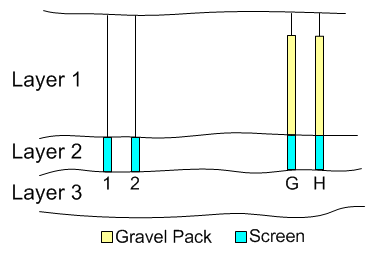
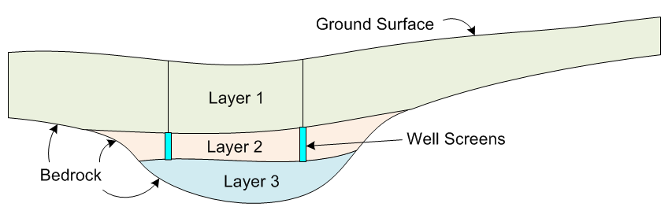
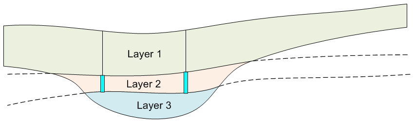
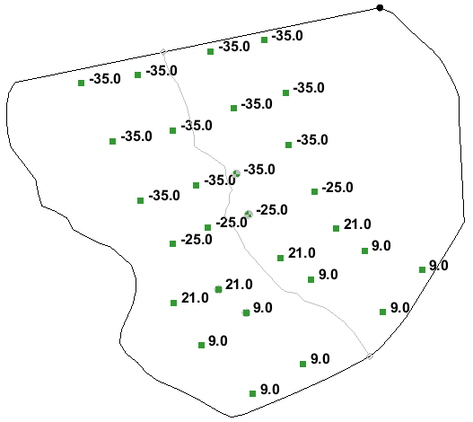
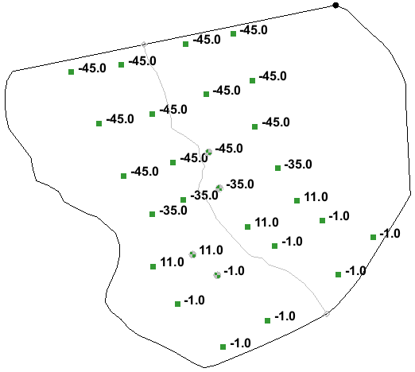

# Case Study #3 - Predictive Model

In this exercise we will change our model from calibration mode to prediction mode. This will include converting it to a multi-layer model.

## Loading the Project

Before continuing,

>>1) Launch GMS and open the calibrated MODFLOW model you created in [<u>Case Study #2</u>](https://byu-ce547.readthedocs.io/en/latest/termproject/casestudy2/case_study_2/).

## Switching to Forward Mode

Once you finish calibrating, you need to change the model from inverse mode to forward mode.

>>1) In the **Parameters** dialog, select the **Import Optimal Values** button. This copies the final computed values to the model inputs. For the pilot points, it creates a new data set for the pilot points and changes the HK parameter option to use this new data set when interpolating the HK values. For the recharge, it copies the optimal recharge value into the starting value field for the recharge.

>>2) From the MODFLOW **Global Options** dialog, change the run type to **Forward run**. 

>>3) If you have turned on any of Convergence options to prevent cell drying, be sure to turn them off.

>>4) Save the project **to a new name** and do a forward run just to make sure everything is working properly. You should end up with the same set of computed heads.

Be sure to save your changes frequently as you update the model. If you have several solutions from the calibration stage, you may wish to delete them from the Project Explorer window to unclutter your project.

## Wells G and H

As you may recall, we set the pumping rate for wells G&H to zero during the calibration phase to ensure that the model would be consistent with the conditions present at the point in time that the field observations for head and flow were recorded. Now that the model is calibrated, we will enter the appropriate pumping rates for the wells to simulate the conditions that were active when the alleged contamination took place.

>>1) Double-click on the coverage containing the wells.

>>2) Enter the following pumping rates for wells G&H:

>>>>|Name|	Flow Rate|
|:--:|:--------:|
| G  |  -33687.0 |
| H  |  -19250.0 |

>>3) Select the **Map -> MODFLOW** command.

>>4) Save and run the model to make sure it still gives reasonable results (make sure the wells don't go dry for example).

## Converting to a Multi-Layer Model

The model we calibrated was a single layer model. This allowed us to solve for a spatial variation of hydraulic conductivity and recharge. When we do particle tracking, it is useful to have a multi-layer model so that we can more accurately locate the well screens vertically. With a single-layer model, it is as if the well were screened from the top of the aquifer to the bottom. With a multi-layer model, we can isolate the screen to one or more model layers and our particle tracking and capture zone analysis will be more accurate.

### Well Screen Elevations

When considering how to construct the layers, the following information from the USGS report may be helpful.

>>_“Well G … is completed to approximately 85 feet below land surface.  The well is constructed of 24-inch diameter steel casing and the bottom 10 feet is screened between 25.5 and 35.5 feet below NGVD of 1929.  The well is gravel packed to within 10 feet of the land surface and grouted to land surface.  Well H was constructed in July 1967 and is completed to approximately 88 feet below land surface.  The well is constructed of 24-inch-diameter steel casing and the bottom 10 feet of the well is screened between 35.0 and 45.0 feet below NGVD of 1929.  The well is gravel-packed to within 10 feet of the land surface and grouted to land surface.” (Myette et al, 1987)_

Note the discussion on the gravel packing. Even though the screen is placed at a lower depth, gravel packing will extend the effective screened interval for the well due to the high permeability of the gravel. Thus, we can assume that the wells are screened from the bottom of the screen up to ten feet below the ground surface. However, we don't want to make a separate layer for the top ten feet of elevation since that will lead to severe model stability issues with dry cells. Furthermore, at all four wells, the observed/computed heads are at least ten feet below the ground surface so we can assume that the wells are screened all the way to the ground surface and it won't affect our model results.

For the industrial wells, well #1 is screened from elevation 11 to 21 feet and well #2 is screened from elevation -1 to 9 ft.

If you double-click on the cells containing the wells, you can view the top and bottom elevations at the well locations. Combining the previous information with the top and bottom elevations, we have the following:

|Well|	Top Elev (ground)|	Screen Top*|	Screen Bottom|	Bottom Elev (bedrock)|
|:--:|:----------------:|:----------:|:------------:|:--------------------:|
| G  |        48        |     38     |     -35      |         -66          |
| H  |        50        |     40     |     -45      |         -72          |
| 1  |        50        |     21     |      11      |         -20          |
| 2  |        50        |      9     |      -1      |         -35          |

_*Top of screen or top of gravel pack._

_Table 1. Well Screen Elevations._

Note that for each well, the bottom of the screen is about 30 ft above bedrock.

At this point, we have at least two options:

>>**Option A)** Split the model into two layers with the bottom of layer 1 corresponding to the screen bottom for all four wells. Assume the screens go all the way to the top of the model and put all wells in layer 1. We don't know whether the industrial wells were gravel-packed like wells G&H, but it would be a reasonable assumption that they were. Either way, we are more concerned with wells G and H so an assumption here won't hurt us.

>>**Option B)** Split the model into three layers. The bottom of layer 2 (top of layer 3) will correspond to the bottom of the screens for all four wells. The bottom of layer 1 (top of layer 2) would correspond to the top of the industrial well screens. The industrial wells would then reside completely in layer 2 and wells G and H would reside in both layers 1 and 2. We can enter the well screen elevations as attributes to the well point features corresponding to wells G and H in the conceptual model and the total pumping rate for each well would be distributed between layers 1 and 2 when the Map -> MODFLOW command is executed. This is illustrated below.

For the purpose of illustrating the steps involved, we will go with option B. You are free to use either option.

### Creating Layer Elevations

Before continuing, it is useful to review the bottom elevations.

>>1) Make sure the contouring option is on.

>>2) Click on the **Bottom elevations** item in the **3D Grid Data/Grid/Global** section of the **Project Explorer**.

>>3) Move your cursor over the model and note the elevations shown in the **F:** display at the top of the GMS window.

You should see the contours of the bedrock. Note that the bedrock follows the shape of a valley with a deep section in the middle where the wells are located. You should also note that the bedrock rises sharply on the eastern side, resulting in a very thin saturated zone. As we split the model layers we need to be careful not to make the layers too thin in this area, or the cells in the upper layers will go dry. A safer option is to limit the multi-layer section of the model to the thicker region in the middle as shown in Figure 1.

_Figure 1. Idealized Cross Section Showing Proposed Layer Configuration._

Note that the cells in layer 1 will be active over the entire model domain but the cells in layers 2 and 3 will only be active in the deeper regions in the middle of the model. This can be easily accomplished using the interplation tools in GMS by interpolating a set of layer elevations for the tops of layers 2 and 3 that match the tops and bottoms of the well screens and project in a relatively flat manner away from the wells shown in Figure 2.

_Figure 2. Layer Elevations Prior to Truncation via GMS Model Checker._

The "truncate to bedrock" option in the **GMS Model Checker** can then be used to automatically adjust the layer elevations.

Before we do the interpolation, we need to create some scatter points. We will first create a scatter point set representing the top of layer 2 (top of well screens). We want to make sure that the elevations match the well screen elevations shown in the above figures. You can do this either by creating two scatter point sets or you can do it with a single scatter point set with two data sets. We will use the latter option.

>>1) Create a new 2D scatter point set and give it a name ("**screen-elevs**" for example).

>>2) Right-click on the data set (it should be called "data" is located underneath the screen-elevs scatter point set) created for the new scatter point set and select the **Duplicate** command.

>>3) Rename the two data sets to something more meaningful ("**bot1**" and "**bot2**" for example).

>>4) Using the **Create Scatter Point** tool , create a point at the location of each of the four wells.

>>5) Using the elevations shown in Table 1 as a guide, enter the top elevations for the well screens in **bot1** and the bottom elevations for the well screens in **bot2**. Remember that the thickness of layer 2 = 10 ft, so the top elevations for layer 2 for wells G & H should be the bottom elevations + 10 ft. Use the **Select Scatter Point** tool  and switch between the two data sets in the **Project Explorer** as you edit the elevations.

Now we need to add some supplemental points to control the interpolation of the surfaces. If we were to interpolate with only four points, we would most likely get oscillation in the surfaces. We want to simply project the trends in the tops and bottom elevations for the well screens so that the surfaces are relatively smooth and flat.

>>6) Using the **Create Scatter Point** tool, create a set of supplemental scatter points similar to the green points shown in Figure 3.

>>7) Make sure the bot1 data sets is active and use the **Select Scatter Point** tool to edit the elevations for the supplemental points. Project the elevations so that the trend is horizontal in the east-west direction and follows the slope of the well screen elevations in the north-south direction as shown in Figure 3.

>>8) Edit the elevations for the upper data set (**bot2**) in a similar fashion.

 

&emsp;&emsp;&emsp;&emsp;&emsp;&emsp;&emsp;&emsp;&emsp;&emsp;&emsp;&emsp;&emsp;&emsp;&emsp;&emsp; (a) Bot1 Elevations &emsp;&emsp;&emsp;&emsp;&emsp;&emsp;&emsp;&emsp;&emsp;&emsp;&emsp;&emsp;&emsp;&emsp;&emsp;&emsp;&emsp;&emsp;&emsp;&emsp;&emsp;&emsp;&emsp;&emsp;&emsp;&emsp;&emsp;&emsp;&emsp;&emsp;&emsp;&emsp;&nbsp;&nbsp; (b) Bot2 Elevations

_Figure 3. Scatter Points at Wells (yellow) and Supplemental Points (green)._

### Splitting the Grid

Before we interpolate the layer elevations, we need to split the single layer in the current grid into three layers.

>>1) Make sure the **3D Grid Data** folder is active in the **Project Explorer**.

>>2) Select one of the cells in the middle of the model domain.

>>3) Click on the **Front View** icon .

>>4) Select the **Split Layer** tool  and click on one of the cells about 1/3 of the way down the cell. Click a second time about 2/3 of the way down the cell.

Note that the grid now contains three layers. The MODFLOW solutions have also been automatically removed since they no longer are compatible with the current grid.

### Interpolating the Elevations

We are now ready to interpolate the new layer elevations.

>>1) Select the **screen-elevs** scatter point set in the **Project Explorer**.

>>2) Open the **Interpolation Options** dialog and change the interpolation option to **Inverse Distance Weighted - Gradient Plane.**

>>3) Select the **Interpolation|Interpolate to MODFLOW Layers** command.

>>4) Note that the data set mapping is automatically initialized. Click **OK** to interpolate.

You should see the new elevations at this point. You may need to turn off the contours so that you can clearly see the cell boundaries. The cells tops and bottoms are inverted on the left and right sides of the model, but we will fix this in the next step. Use the up and down arrows in the Mini Grid control below the Project Explorer to view the elevations along the different rows of the grid. If necessary, adjust your elevations and reinterpolate. Make sure your layers don't get too thin and make sure that the top of layer 2 does not get close to the top of layer 1.

### Fixing the Elevation Errors

Due to the manner in which the bot1 and bot2 surfaces project through the model domain, many of the cells in layers 2 and 3 are inverted (bottom elevation is above top elevation) on the left and right sides of the model. We need to inactivate these cells and adjust the bottom elevation of the remaining active cells to be coincident with the bedrock elevations. This can be easily fixed using the Model Checker.

>>1) Select the **MODFLOW|Check Simulation** command.

>>2) Click on the **Run Check** button. You should see several errors appear.

>>3) Click on the **Fix Layer Errors** button.

>>4) Select **Truncate to bedrock** on the left and select **Layer 3** on the right. Click on the **Fix Affected Layers** button. (NOTE: if you see any errors in the other layers, something went wrong. Try redoing the interpolation using IDW constant interpolation for the intermediate layer elevations)

>>5) Exit both dialogs.

### Viewing the Grid in 3D

Once again, use the viewing options in front view to examine the results. Another way to view the results is the put the grid into general view mode for 3D viewing and rotation. This is especially useful if each of the three layers has a different color.

First we will create three materials:

>>1) Select the **Edit|Materials** dialog.

>>2) Create three materials and name them **layer_1**, **layer_2**, and **layer_3**.

>>3) Change the material colors.

>>4) Exit the dialog.

Next, we will assign the materials to the cells.

>>5) Switch to plan view .

>>6) Use the **Select Layer** tool  to select all cells in the top layer.

>>7) Click on the **Properties** icon  and change the material type (if necessary) to **layer_1**.

>>8) Switch to layers 2 & 3 and repeat the previous steps to assign **layer_2** to the second layer and **layer_3** to the third layer.

Now we are ready to view the grid in 3D.

>>9) Click on the **Ortho/General Mode** icon  to exit ortho mode.

>>10) Click on the **Oblique View** icon .

>>11) Open the **Display Options** dialog and turn on the **Cell Faces** option. Change the **Color** option to **Material** and exit the dialog.

>>12) Use the Rotate tool  to view the grid from various angles.

If you see some problems, you will need to edit the scatter point elevations and redo the interpolate/fix processes. When you are finished:

>>13) Switch back to plan view.

>>14) Turn off the display of the cell faces.

>>15) Switch back to ortho mode.

### Resetting the Model

Now that the layers have been fixed, we need to rebuild the MODFLOW data (K, recharge, rivers, wells, etc). Most of it can be rebuilt from the conceptual model, but we will need to make some additional adjustments.

First, we will change the range of the **active zone** coverage to include all three layers.

>>1) Double-click on the active zone coverage.

>>2) Turn on the **Layer range** option and select **OK**.

>>3) Right-click on the coverage and select the **Attribute Table** command.

>>4) Make sure the polygons are displayed and change the layer range to 1-3 for the main polygon.

Next, we will set the layer range for the wells so that they are mapped to the appropriate layers. For the industrial wells, we will just assign them directly to layer 2. Wells G and H overlap both layers 1 and 2 so we will use the well screen option to let GMS divide the pumping rate between the two layers based on how much of the screen overlaps each layer.

>>5) Double-click on the coverage containing the wells.

>>6) Turn on the **Layer range** option and select **OK**.

>>7) Right-click on the coverage and select the **Attribute Table** command.

>>8) Make sure the points are displayed and change the layer range to 2-2 for the two industrial wells.

>>9) Turn on the **Use Screen** option and enter the following elevations for wells G and H:

>>>>|Name|	Top scr.|	Bot scr.|
|:--:|:--------:|:-------:|
| G  |    38    |   -34.5 |
| H  |    40    |   -44.5 |

>>10) Select the **Map -> MODFLOW** command.

>>11) Switch between the three layers in ortho mode to ensure that the wells were mapped to layer 2 and the river was mapped to layer 1.

This step is optional, but we may get more stable results if we adjust the hydraulic conductivity of the cells containing the wells. This reduces the risk that the wells will dry out and simulates the flushing of the fines that often occurs in the vicinity of the wells. Since our cells are small (40 ft), this simulates flushing out to a radius of about 20 ft.

>>12) Select the cells in layer 1 at the location of each of the four wells.

>>13) Bring up the **Properties** dialog and change the hydraulic conductivity to 50. _This assumes that the K values surrounding your wells are lower than 50. If not you probably don't need to bother._

>>14) Repeat for the cells at the well locations in layer 2.

Finally, we need to check the hydraulic conductivity. Recall that we assigned a key value of -100 to all cells in the HK array and used the pilot points to interpolate the K values to the cells. When we split the cells to make the new layers, the new cells inherited the key value. Thus, we don't need to do anything. The same K values will be interpolated to layers 2 & 3 which is what we want.

### Running MODFLOW

Finally, we are ready to run MODFLOW.

>>1) Save and run MODFLOW.

>>2) Read in the solution when the solver finishes and cycle through the layers to view the results.

Note that the heads look very similar to the one layer solution. This is what we expect. But the new layering may affect our particle tracking results.

**We are now ready to use the predictive model for our analysis!**
