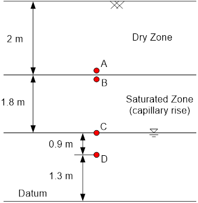

# Exercise - Head Calculations

# Part 1 - Capillary Rise

Fill in the missing values:

| Point | Hel | Hp | Ht |
|-------|:---:|:--:|:--:|
| A     |     |    |    |
| B     |     |    |    |
| C     |     |    |    |

Excel starter file: [head calc.xlsx](Excel%20files/head%20calc.xlsx)

Excel solution: [head calc (key).xlsx](Excel%20files/head%20calc%20%28key%29.xlsx)

Excel starter file: [cylinder.xlsx](Excel%20files/cylinder.xlsx)

Excel solution: [cylinder_key.xlsx](Excel%20files/cylinder_key.xlsx)