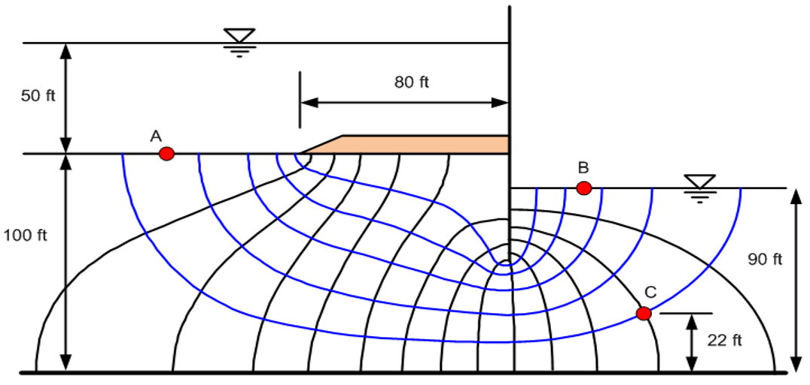
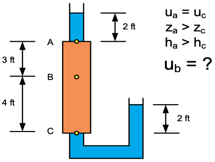

# Exercise - Head Calculations

# Part 1 - Capillary Rise

Consider the following soil profile:

Using hydraulic head prinpciples, fill in the following table for each point in the soil profile. 

| Point | Hel | Hp | Ht |
|-------|:---:|:--:|:--:|
| A     |     |    |    |
| B     |     |    |    |
| C     |     |    |    |

# Part 2 - Flow Net Calculations

Consider the following flow net:

{width="700px"}

Calculate the elevatin head, pressure head, and total head at points A, B, and C.

For both part 1 and part 2, you can use the following Excel files to assist with your calculations.

Excel starter file: [head calc.xlsx](Excel%20files/head%20calc.xlsx)

Excel solution: [head calc (key).xlsx](Excel%20files/head%20calc%20%28key%29.xlsx)

# Part 3 - Cylinder Calculations

Consider the following cylinder:

Calculate the pore pressure at point B.

Excel starter file: [cylinder.xlsx](Excel%20files/cylinder.xlsx)

Excel solution: [cylinder_key.xlsx](Excel%20files/cylinder_key.xlsx)