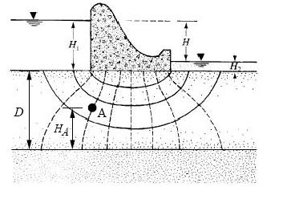

# Homework #1 - Hydraulic Head Calculations

Solve the following problems. 

1. A piezometer is placed in the ground at a site. The screen on the piezometer is at a depth of 266.5 ft. The elevation of the ground surface where the piezometer is located is 3049.0 ft above mean sea level. The pore pressure measured by the piezometer is 52.7 psi. Assume that sea level is the datum. At the location of the piezometer screen:

>a) What is the elevation head? [ft] 
b) What is the pressure head? [ft] 
c) What is the total head? [ft]

2. The following diagram represents a flow net describing seepage of water below a concrete coffer dam resting on a permeable soil which rests on impermeable bedrock. Recall that the the solid lines are flow lines and the dashed lines are equipotential lines. There is an equal amount of water through the flow channels defined by pairs of flow lines and the equipotential lines are contours of total head indicating head loss as water flows from the upstream side to the downstream side through the soil below the dam.

>

>Assume:

>H1 = 30 m 
H2 = 8 m 
D = 50 m 
Ha = 22 m 
Datum = Base of saturated soil (top of bedrock).

>Calculate:

>a) Total head at point A. 
b) Elevation head at point A. 
c) Pressure head at point A. 
d) Pore pressure (kN/m2) at point A.

## Submission

Save your work in a file named `head_hw.xlsx` and upload it on Learning Suite after we grade it together in class.

## Grading Rubric

Self-grade your assignment using the following rubric. Enter your points in the "Submission notes" section for the assignment on Learning Suite when you upload your file. You can use fractional points if you like (e.g. 2.5).

| Criteria                                    | Points |
|---------------------------------------------|:------:|
| Completed on time and all or mostly correct |   3    |
| Completed more than half of assignment      |   2    |
| Made an effort                              |   1    |
| Did nothing                                 |   0    |
