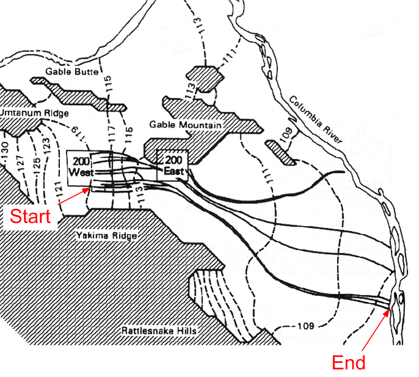
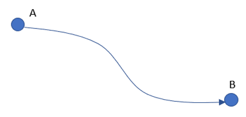
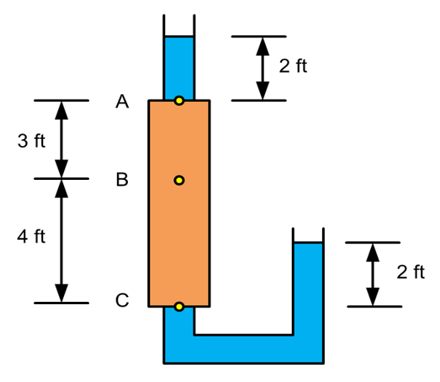

# Exercise - Darcy's Law Calculations

# Part 1 - Travel Time Problem

You have been hired as a consultant for 
the Hanford DOE site in Washington state 
and you are reviewing the output from a 
groundwater model developed as part of an 
earlier study. The computed heads and 
pathlines from the model are shown below. 
You are asked what is the minimum travel 
time from the 200 west site to the Columbia 
river. Assume that the length of the flow 
path shown on the diagram is 20 miles. The 
head contours are in meters. The hydraulic 
conductivity is 150 ft/day and the porosity 
is 0.3. What is your answer?

Solution: [columbia_key.md](columbia_key.md)

Solution file (ppt): [columbia (key).pptx](columbia%20%28key%29.pptx)

# Part 2 - Travel Time

Consider the following flow path:

The water level in an observation well A is measured at **1274.4** m. At a point **406** m downgradient from that point, the water level in a second well (B) is measured at **1258.3** m. 
a. What is the hydraulic gradient between well A and well B? 
b. Assuming that the hydraulic conductivity is 1 m/day and the effective porosity is 0.15, what is the seepage velocity between the two point? [m/day] 
c. How long would it take for a particle to travel from well A to well B? [days]

Excel starter file: [darcy.xlsx](darcy.xlsx)

Excel solution: [darcy (key).xlsx](darcy%20%28key%29.xlsx)

# Part 3 - Flow Volumes

Consider the following cylinder:

Water is flowing through the column of soil on the left. Assume that the cross-sectional area of the column = 0.8 ft^2 and K = 8.5 ft/day. How much water will flow through the column in 5 days time?

Excel starter file: [darcy.xlsx](darcy.xlsx)

Excel solution: [darcy (key).xlsx](darcy%20%28key%29.xlsx)