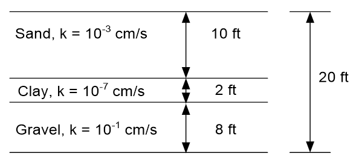
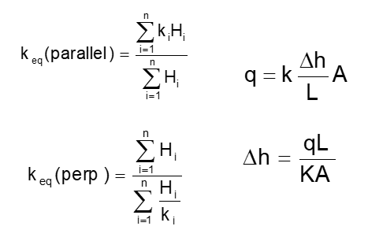
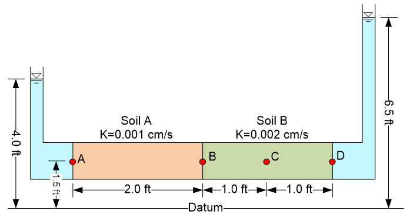
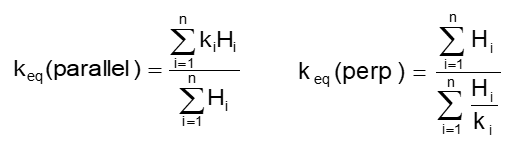
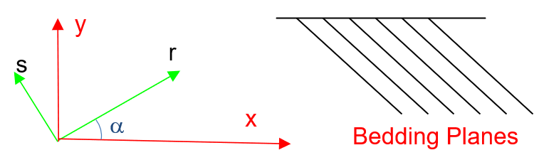
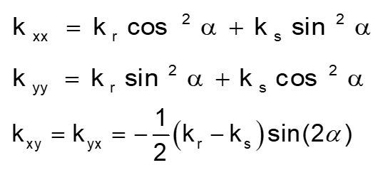

# Exercise - Darcy Flow Through Layered Systems

# Part 1 - Layered Soils

Consider the following layered soils:

Calculate the flow parallel and perpendicular to the layering. Use the following parameters: Driving head = 5 ft. Width (dx) = 100 ft. Height (dy) = 20 ft.

Excel starter file: [layers.xlsx](Excel%20files/layers.xlsx)

Excel solution: [layers (key).xlsx](Excel%20files/layers%20%28key%29.xlsx)

# Part 2 - Two Soils in a Cylinder

Consider the following cylinder:

Calculate the total head, elevation head, pressure head, and pore pressure at points A, B, C, D

Excel starter file: [twosoils.xlsx](Excel%20files/twosoils.xlsx)

Excel solution: [twosoils (key).xlsx](Excel%20files/twosoils%20%28key%29.xlsx)

# Part 3 - Darcy's Law in 2D (Transformations)

Consider the following:

Calculate the hydraulic conductivity tensor for the bedding planes as shown on the right based on an angle of rotation.  Keep in mind that a clockwise rotation as shown in the figure is negative.

Excel starter file: [darcy2d.xlsx](Excel%20files/darcy2d.xlsx)

Excel solution: [darcy2d (key).xlsx](Excel%20files/darcy2d%20%28key%29.xlsx)