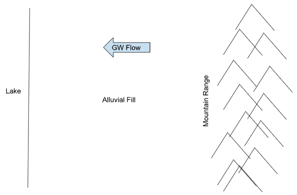

# Mountain-Lake Model

Consider the following site:

Build a simple groundwater model representing this system. Input is from recharge. Parallel flow boundaries on the top and bottom.

1. Build grid
>a. X, length = 20000, 100 cells 
>b. Y, length = 15000, 75 cells 
>c. Z, length = 500, 1 cell 

2. Properties
>a. Top = 3200, bottom = 2700 
>b. K = 2 ft/day 

3. Recharge
>a. 20 inches of rain per year 
>b. 15% reaches aquifer

4. Lake
>a. Specified head 
>b. Elevation = 3000

5. Save and run model  
6. Add a well
>a. Permitted at 10 AFA (acre-ft/year)

7. Explore
>b. Pumping rate (bigger) 
>c. More wells 
>d. K value 
>e. Recharge

## Solution

Click here to see calculation details:

 

<strong>Recharge:</strong> 
• 20 inches of rain per year 
• 15% reaches aquifer 
• 20/12*0.15/365=0.0006849315 ft/day 

 

<strong>Well:</strong> 
• Permitted at 10 AFA (acre-ft/year) 
• 10*43560/365 = 1193.4 ft^3/day 

 
Video: [<u>www.youtube.com/watch?v=4sy4xoizQso</u>](https://www.youtube.com/watch?v=4sy4xoizQso)