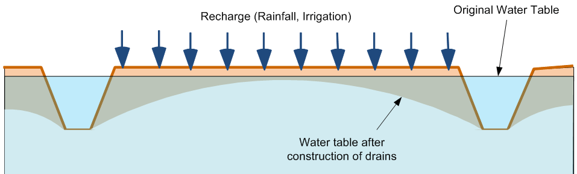
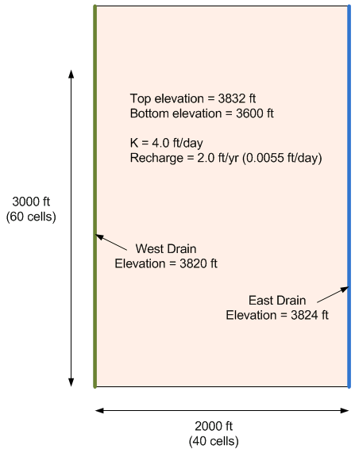

# MODFLOW Case Study - Agricultural Drains

Drains are sometimes used in agricultural regions with high water tables. Drains are thought to create a healthier environment for plant growth and to dry the soil so that it can be accessed by farm equipment throughout the crop production cycle. Drainage can also reduce saline-alkiline problems.

One type of agricultural drain is a simple trench as shown below. The drain acts as a fixed head boundary.

The objective of this exercise is to build a MODFLOW model to simulate the lowering of the water table at a farm as a result of two parallel agricultural drains constructed as trenches. The problem details are shown in the following figure. We will assume that the fields and drain continue to the north and south and we will assume parallel flow boundaries at the north and south ends.

**Main Steps**

1) Build the grid

3) Initialize MODFLOW and turn on the Recharge package

4) Assign K value to all cells

5) Assign recharge value to all cells

6) Make specified head boundaries on two sides

7) Save project

8) Run MODFLOW

9) View Solution

## Solution

Step-by-step instructions with screen shots: [<u>Agricultural Drains, Part 1.pptx</u>](Agricultural%20Drains%2C%20Part%201.pptx)

GMS project file with final version of model: [<u>agdrains1.zip</u>](agdrains1.zip)

Video: [<u>www.youtube.com/watch?v=xO4--6mdj4M</u>](https://www.youtube.com/watch?v=xO4--6mdj4M)

# MODFLOW Case Study - Agricultural Drain Model, Part 2

In this exercise, we will revisit the agricultural drain model we built for our [<u>previous in-class</u>](https://byu-ce547.readthedocs.io/en/latest/unit2/02_study_pt1/study_pt1_class/) task.

Click [<u>here</u>](agdrains1.zip) to download a completed version of the previous model. Unzip the model and load it into GMS. Then do the following:

1) Analyze the flow budget
>a) Select the cells on each side and change the zone budget id's. Use 2 on the left and 3 on the right. 
>b) Look at the flow budget. What percentage of the water goes to the left drain vs. the right drain? 

2) Add a well in the interior.
>a) Use Q = -2000 ft^3/day 
>b) Use Q = -5000 ft^3/day

Review the flow budget again. Note that the well is taking water from both drains. Consider what would happen if the well were located closer to one of the drains.

3) Determine impact of using a 2D model
>a) Delete the well(s) added in the prior step. 
>b) Set the head contours to a fixed interval (1.0) and save a copy of the contours to a CAD layer. 
>c) Rebuild the model using a multi-layer grid (six layers). Assign head bc to top layer only and re-enter the inputs in the same order used in the first exercise. Let Kv=Kh for now. 
>d) Compare the contours. Is there a significant difference? 
>e) Has the flow budget changed?

4) Determine impact of vertical anisotropy
>a) Save another copy of head contours. 
>b) Change Kv=Kh/5=0.8.> 
>c) Save and run the model. Compare the solution.

5) Determine impact of using drains vs. constant head bc for ag drains.
>a) Save another copy of head contours. Note the flow budget. 
>b) Remove fixed head BC and add drains to left and right side. Use a large value for conductance (1e6). 
>c) Save and run. Compare results. 
>>Note: You may need to reduce the acceleration (relaxation) parameter to get the PCG solver to converge. Try reducing from 1.0 to 0.2 in the PCG Package dialog.

>d) Compute a drain conductance value assuming K=0.5, L=50, width=6, thickness=3. Enter CD, save and run again. Compare results.

## Solution

Step-by-step instructions with screen shots: [<u>Agricultural Drains, Part 2.pptx</u>](Agricultural%20Drains%2C%20Part%202.pptx)

GMS project file with final version of model: [<u>agdrains2.zip</u>](agdrains2.zip)

Video: [<u>www.youtube.com/watch?v=0RamLwB37kk</u>](https://www.youtube.com/watch?v=0RamLwB37kk)

 
 

 
