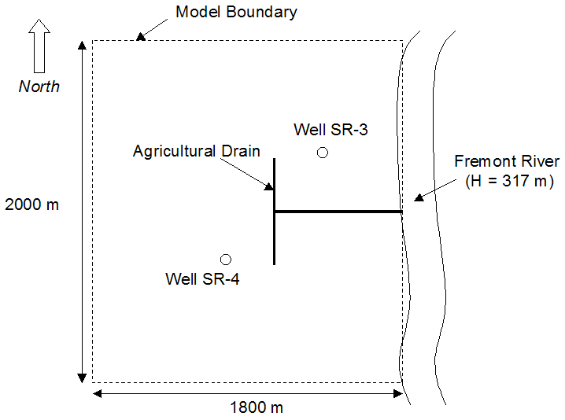

# MODFLOW Case Study - Fremont River Model

For this case study, we will be solving the problem shown in the following figure using a one layer MODFLOW model.  Since the model domain is rectangular and the source/sink objects are simple, we can set up this model quickly using the “grid approach”.  The site is 1800 m wide from east to west and 2000 m wide from north to south.  The west boundary corresponds to a ground water divide and the north and south boundaries correspond to parallel flow boundaries.  Thus, these three boundaries will be simulated as no-flow boundaries.  The east side of the model corresponds to a river that will be modeled with a constant head boundary.  Two production wells and an agricultural drain are located within the model domain.

**Background Image**

Before building the model, first download and unzip the following file:

[startfiles.zip](startfiles.zip)

Then launch GMS and read in the project file (map.gpr) using the **File|Open** command.

**Steps**

Build your MODFLOW model using the following basic steps:

1) Create a one layer grid of the proper X and Y dimensions and use 45 cells in the X direction and 50 cells in Y direction.

2) Save your project to a new file name (use the Save As command) and save the model frequently during the exercise.

3) Initialize your MODFLOW simulation. 

a) Select the appropriate units (length = m, and time = d).

b) Select the packages you wish to use.

c) Enter a top elevation of 400 m and a bottom elevation of 250 m.  For simplicity, we will assume that the top and bottom of the aquifer are relatively flat.

4) Create a constant head boundary on the right side of the model = 317 m.

5) In the LPF package, use a convertible layer.  Enter a value of K = 0.1 m/d for the entire grid.

6) Enter a recharge value of 0.00055 m/d for the entire grid.

7) Create a set of drains in the location of the agricultural drain.  Enter a conductance of 200 m^2/d and use a drain elevation = 317m.

8) Create two wells at the location shown.

a) For well SR-3, enter a pumping rate of –300 m^3/d.

b) For well SR-4, enter a pumping rate of –450 m^3/d.

9) Check your model for errors and then save and run the simulation.

**Analysis**

If your solution is successful, you may wish to try modifying your model as follows:

1) Change the conductance on the drains and see if it makes a significant difference in the solution.

2) Try increasing the pumping rate for the wells to see what happens to the drawdown.  At some point the wells will go dry.

3) Change the hydraulic conductivity and the recharge and notice how sensitive the model is to these two parameters.

 

 