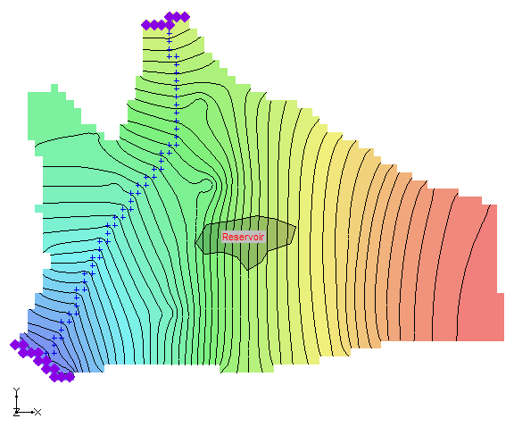

# Homework #6 - MODFLOW Grid Approach, Part 2

_Note: You may **NOT** work in pairs on this assignment._

Solve the following problem.

The objective of this assignment is to add a reservoir to an existing model via the GHB package and iterate the model solution until the flow budget reaches a target amount.

Do the following:

1) Download and unzip the following project:

>>[<u>resmod.zip</u>](zip%20folders/resmod.zip)

2) Open the project within GMS.

>>This is a completed MODFLOW model of a site. However, we need to add a reservoir to the model in the location shown. This is a small reservoir used for irrigation. 

3) Add the reservoir to the model using the GHB package. Mark all cells under the reservoir as GHB cells. You may wish to use the "Select with Poly" tool to select the cells under the reservoir, or you can hold down the shift key to multi-select the cells one at a time.

4) Enter a stage for the reservoir of 1200 ft.

5) Compute an initial estimate of the reservoir conductance to apply to each of the GHB instances. The cells are 400 ft x 400 ft. Assume that the K of the reservoir sediments is about 0.0001 ft/day and that the sediments are about 10 ft thick.

6) Save and run the model.

7) Use the flow budget tool to view the seepage from the reservoir into the aquifer. The item you will be looking for in the Flow Budget dialog is "HEAD DEP BOUNDS" (this is where the GHB flow is listed). Adjust the conductance up or down as necessary until the loss from the reservoir is about 5000 ft^3/day.

_**Note:** As you change the conductance of your GHB cells, do NOT reselect the cells with the **Select with Poly** command. Once the GHB cells are created, it is much easier to edit the conductance using the **GHB Package** dialog. You can get to this dialog using the **MODFLOW|Optional Packages|General Head Boundary** command in the **3D Grid Module**._

## Submission

Save the GMS project with the completed solution. Zip up all files associated with the project. Name your zip folder `study_pt2_hw.zip` and upload it to Learning Suite.

