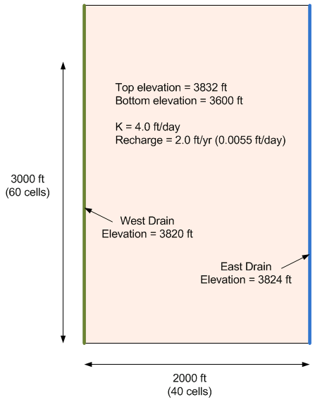

# MODFLOW Case Study - Agricultural Drain Model, Part 3

In this exercise, we will revisit the agricultural drain model we built for our previous in-class task.

Click [<u>here</u>](agdrains2.zip) to download a completed version of the previous model. Unzip the model and load it into GMS. Then do the following:

1) Select some cells in the middle and add an irrigation pond using the GHB package. Let the elevation = 3830 and use a large value for conductance (2000 ft^2/day). Note: using a larger value of conductance such as 1e6 leads to a model that will converge but it has mass balance errors.

2) Save and run. Look at heads and flow budget.

3) Compute a conductance assuming pond is lined with a K=0.01 ft/day material with thickness= 1 ft. Save and run. What is the impact on heads and flow budget?

Step-by-step instructions with screen shots: [<u>Agricultural Drains, Part 3.pptx</u>](Agricultural%20Drains%2C%20Part%203.pptx)

GMS project file with final version of model: [<u>agdrains3.zip</u>](agdrains3.zip)

Video: [<u>www.youtube.com/watch?v=EFG0KVHS2q8</u>](https://www.youtube.com/watch?v=EFG0KVHS2q8)