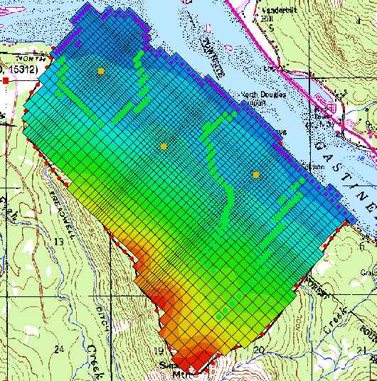

# Homework #7 - Elevation Data Interpolation

_Note: You may work in pairs on this assignment._

Solve the following problem.

The objective of this assignment is to interpolate a set of MODFLOW layer elevations using the scatter point tools in GMS. We will start with an existing MODFLOW model:

Do the following:

1) Download and unzip the following project:

>>[<u>interpcase.zip</u>](interpcase.zip)

2) Open the project within GMS. This is a partially completed one layer MODFLOW model of a site. However, we need to interpolate the top and bottom elevations and a set of starting heads.

3) Note that there are two text files in the folder with scatter point data:

elevs_bottom.txt 
elevs_top.txt

Open the files in text editor to review the contents. One contains a series of elevations for the top of the aquifer and the other contains a series of elevations for the bottom of the aquifer.

4) Use the File|Open command to import each of the two text files as 2D Scatter Point sets.

5) Use the **elevs_top** scatter point set to interpolate to the MODFLOW top elevation array.

6) Use the **elevs_bottom** scatter point set to interpolate to the MODFLOW bottom elevation array.

7) Redo the interpolation while experimenting with 2-3 of the other interpolation options. Save the interpolated arrays that you are the most comfortable with.

## Submission

Save the GMS project with the completed solution. Zip up all files associated with the project.

Name your zip folder `geostats_hw.zip` and upload it on Learning Suite after we grade it together in class.

## Grading Rubric

Self-grade your assignment using the following rubric. Enter your points in the "Submission notes" section for the assignment on Learning Suite when you upload your file. You can use fractional points if you like (e.g. 2.5).

| Criteria                                    | Points |
|---------------------------------------------|:------:|
| Completed on time and all or mostly correct |   3    |
| Completed more than half of assignment      |   2    |
| Made an effort                              |   1    |
| Did nothing                                 |   0    |
