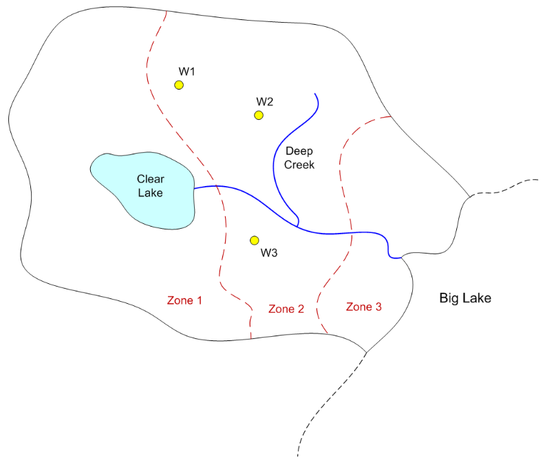

# MODFLOW Conceptual Model Approach - Big Lake

For this exercise we will create a MODFLOW model for the following site using the conceptual model approach:

To build the model, do the following:

1) Download and unzip the following file. Launch GMS and open the project file (start.gpr) contained in the zip archive.

>[biglake.zip](biglake.zip)

2) Set units (m, d)

3) Create a MODFLOW conceptual model

4) Create a **boundary** coverage using three arcs. Put two separate arcs on right side next to the lake.

5) Duplicate the boundary coverage to make a **source/sink** coverage. Turn on the following attributes:

>Wells 
>Refine points 
>Specified head 
>General head 
>River

6) Use the **Build Polygon** command to build a variable head polygon that defines the active area.

7) Create spec head boundary on Big Lake side

>Spec head = 100 m

8) Create river arcs

>a) Calculate conductance per unit length 
>>width = 5 m  
>>vertical thickness = 2 m 
>>K = 0.01 m/d 
>>Cond = Kw/t = (0.01)(5)/(2) = 0.025 

>b) Assign heads and bottom elevations 
>>Head at lake = 120, Rbot = 117 
>>Head at upper right end = 118, Rbot = 115 
>>Head at junction = 110, Rbot = 107 
>>Head at bottom = 100, Rbot = 97

9) Create general head boundary for lake. Build polygons.

>a) Stage = 120 m 
>b) Calculate conductance per unit area 
>>Vertical thickness = 4 m 
>>K = 0.01 m/d 
>>Cond = K/t = 0.01/4 =  0.0025

10) Create the wells

>a) Refine Data (for all) 
>>Base size = 10 
>>Bias = 1.1 
>>Max cell size = 40

>b) Flowrates 
>>Q1 = -4000 m^3/d 
>>Q2 = -3000 
>>Q3 = -2500

11) Duplicate the boundary coverage to make a **K** coverage. Build three polygons corresponding to the three zones shown on the map. Enter the following K values:

>Zone 1: K= 1 
>Zone 2: K = 2 
>Zone 3: K = 0.5

12) Duplicate the boundary coverage to build a **recharge-elev** coverage. Turn on the recharge, top elevation, and bottom elevation attributes. Build a single polgyon and assign the following values:

>Recharge = 0.0002 m/d 
>Top = 120 m 
>Bottom = 10 m

13) Create a grid frame and fit it to the site.

14) Build the grid.

15) Initialize MODFLOW

16) Activate cells in coverage

17) Map -> MODFLOW

18) Run the Model Checker

19) Save and run the model

## Solution

GMS project file with solution: [<u>solution.zip</u>](solution.zip)

Step-by-step instructions: [<u>biglake script.pptx</u>](biglake%20script.pptx)

Video: [<u>www.youtube.com/watch?v=WuyRpQ4yHDE</u>](https://www.youtube.com/watch?v=WuyRpQ4yHDE)

 

 

 

 