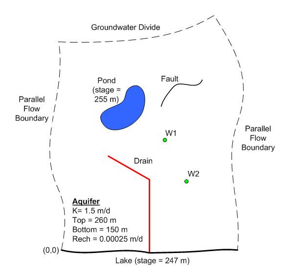

# Homework #8 - MODFLOW Conceptual Model, Part 1

_Note: You may work in pairs on this assignment._

Solve the following problem.

In this exercise you will be building a MODFLOW model of the following site using the conceptual model approach in GMS:

Click [<u>here</u>](modfconc1.zip) to download a zip file containing a GMS project file with a background image. Open the resulting project file into GMS.

Then do the following:

1) Create a MODFLOW conceptual model object in the Project Explorer Window.

2) Create a boundary coverage with a set of arcs looping around the outer boundary of the model.

3) Duplicate the boundary coverage and create a coverage for your sources & sinks called **ss.** Select the properties required you think you will need for all of the sources/sinks (wells, drains, etc.). Be sure to include **Refine points.**

4) Mark the bottom arcs as specified head arcs. Assign the head shown above to the nodes.

5) Create the drain arcs. Compute the appropriate value for conductance based on the following parameters. Enter the appropriate drain elevations at the nodes.

>>K = 0.05 m/d 
>>Average drainage length (from aquifer to drain) = 0.5 m 
>>Average drain width = 2.0 m.

>>| Location                               | Drain Elevation |
>>|----------------------------------------|:---------------:|
>>| Top                                    |     248.0 m     |
>>| Middle (junction between two sections) |     247.5 m     |
>>| Bottom (at lake)                       |     247.0 m     |

6) Create a general head polygon for the pond. Don't forget to select the **Build Polygons** command. Enter a head value corresponding to the pond stage shown above (255 m). Compute an appropriate conductance assuming the following for the sediments lying underneath the pond:

>>K = 0.002 m/d 
>>Average drainage length (from pond to aquifer) = 2.0 m

7) Create two wells at the locations shown. Both wells are extraction wells with the following pumping rates. Use the indicated refinement properties for both wells.

>>W1: Q = 300 m3/d 
>>W2: Q = 200 m3/d

>>Refinement: 
>>base size = 10 m 
>>bias = 1.1 
>>max size = 50 m

8) Enter a barrier at the location shown for the fault using an arc. Enter a hydraulic characteristic = 0.0001 d^-1.

9) Duplicate the boundary coverage to create an **aquifer** coverage. Use this coverage to assign K, top elevation, and bottom elevation. Build a single polygon from the boundary and assign the values shown in the figure above.

10) Duplicate the boundary coverage and create a **recharge** coverage. Build a polygon and assign the recharge value shown above.

11) Create a grid frame that just surrounds your conceptual model.

12) Create a 3D grid using the **Map -> 3D Grid** command.

13) Initialize your MODFLOW simulation.

14) Select the **Map -> MODFLOW** command to convert your conceptual model data to cell-based input.

15) Save and run your simulation.

## Submission

Save the GMS project with the completed solution. Zip up all files associated with the project.

Name your zip folder `regional_models_hw.zip` and upload it on Learning Suite after we grade it together in class.

## Grading Rubric

Self-grade your assignment using the following rubric. Enter your points in the "Submission notes" section for the assignment on Learning Suite when you upload your file. You can use fractional points if you like (e.g. 2.5).

| Criteria                                    | Points |
|---------------------------------------------|:------:|
| Completed on time and all or mostly correct |   3    |
| Completed more than half of assignment      |   2    |
| Made an effort                              |   1    |
| Did nothing                                 |   0    |
