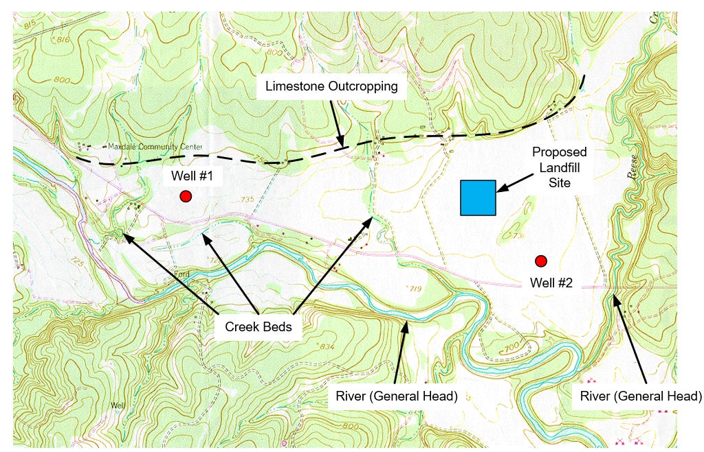

# MODFLOW Conceptual Model Approach, Part 1 - East Texas

For this exercise we will create a MODFLOW model for the following site using the conceptual model approach:

We will build this model using a set of 4 tutorials. In this exercise, we will complete part 1. We will build a model that includes the river boundary conditions and recharge on a 1-layer grid. In the subsequent parts, we will add the wells, drains (creek beds), partitioned recharge, multiple layers, etc. In other words, we will start with the simplest version of the model and incrementally add complexity.

1) Go to the Aquaveo tutorial website:

>[<u>http://www.aquaveo.com/software/gms-learning-tutorials</u>](http://www.aquaveo.com/software/gms-learning-tutorials){target="_blank"}

2) Click on the MODFLOW tab. 

3) Download and unzip the zip archive associated with the **Conceptual Model Approach 1** tutorial exercise.

4) Download and open the PDF file associated with the **Conceptual Model Approach 1** tutorial exercise.

5) Follow the instructions to complete the tutorial.

## Solution

The zip archive associated with the tutorial includes a sample solution to the exercise.

Video: [<u>www.youtube.com/watch?v=5-0uH1K_9po</u>](https://www.youtube.com/watch?v=5-0uH1K_9po)

# MODFLOW Conceptual Model Approach, Part 2 - East Texas

For this exercise we will complete part 2 of the conceptual model approach tutorial. In Part 1, we built a one-layer model using the conceptual model approach. The model includes general head boundary conditions for two rivers at the south and east ends of the model and we used a constant value for K and the top and bottom elevations. In this exercise, we will add recharge, two wells, and a set of drains to model the three creek beds.

To build the model, do the following:

1) Go to the Aquaveo tutorial website:

>[<u>http://www.aquaveo.com/software/gms-learning-tutorials</u>](http://www.aquaveo.com/software/gms-learning-tutorials){target="_blank"}

2) Click on the MODFLOW tab.

3) Download and unzip the zip archive associated with the **Conceptual Model Approach 2** tutorial exercise.

4) Download and open the PDF file associated with the **Conceptual Model Approach 2** tutorial exercise.

5) Follow the instructions to complete the tutorial.

## Solution

The zip archive associated with the tutorial includes a sample solution to the exercise.

Video: [<u>www.youtube.com/watch?v=eF3bz0zYQsI</u>](https://www.youtube.com/watch?v=eF3bz0zYQsI)

 

 

 

 

 

