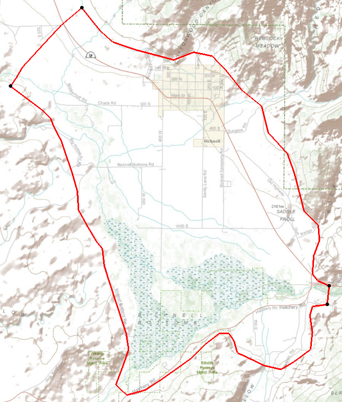
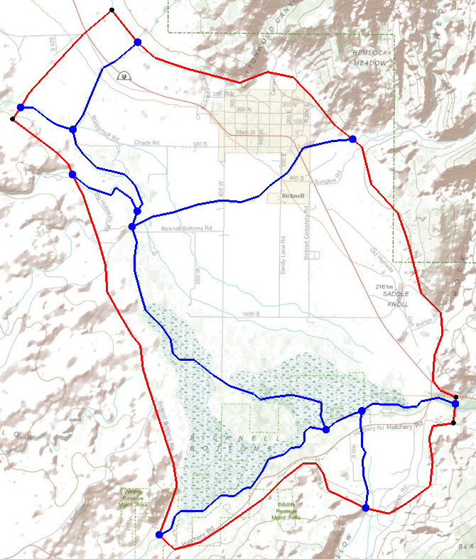
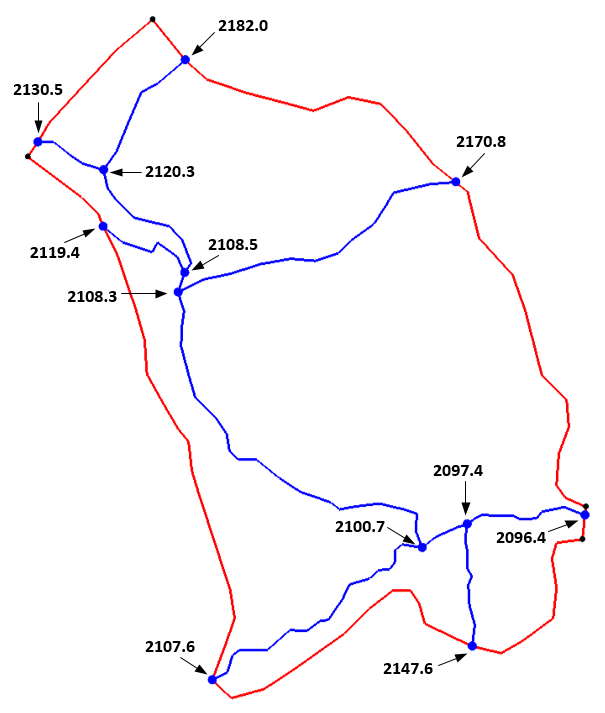
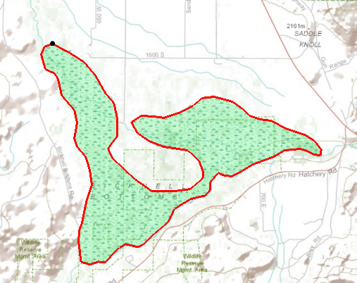
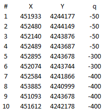
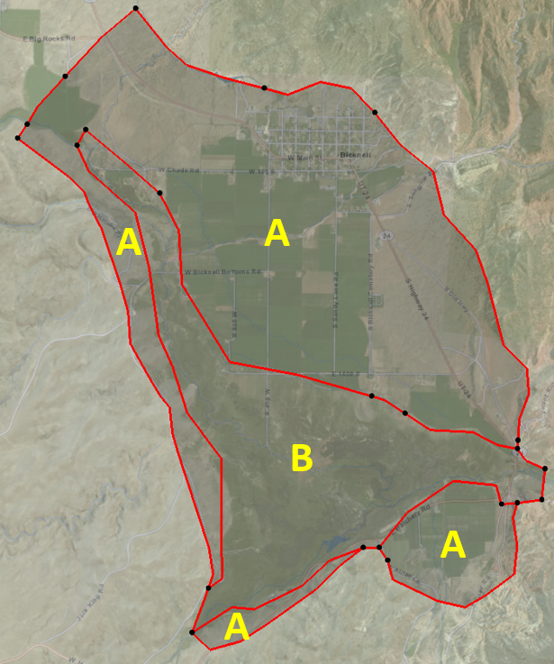
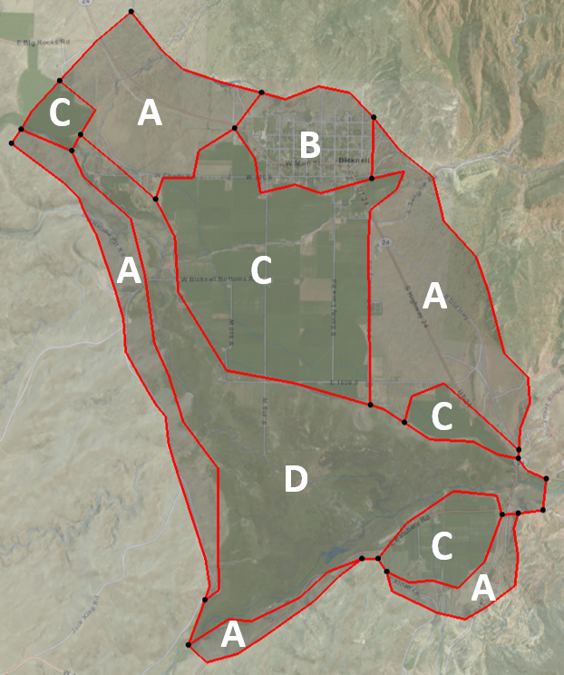

# Homework #9 - Bicknell Bottoms MODFLOW Model

_Note: You may work in pairs on this assignment._

Solve the following problem.

In this exercise, we will create another MODFLOW simulation via the conceptual model approach using the tools in the GMS Map Module. The site is located in south-central Utah, near Capital Reef National Park. While the site and base maps are real, the aquifer properties and other data related to the flow budget are not based on actual data.

Complete the following steps:

**1) Read in the base map files**

First, we will read in a GMS project file that contains some basemap images. It also contains some files that we will import to use as data for our project. Right-click and download the following zip archive. Unzip the resulting file to a new empty directory.

>>[<u>start.zip</u>](start.zip)

Note that the project contains four basemaps: three background images and one elevation dataset. These were created using the "Add Online Maps..." command and then exported to a local copy. The images will be used to digitize data and the elevations will be used to interpolate the ground surface elevations. Turn each of the images on and off to familiarize yourself with them.

Note that this project also has a default projection that we will use (UTM, NAD83).

Save the project under a new name and save your changes frequently!

**2) Create a conceptual model**

Create a conceptual model object and give it a name.

**3) Boundary coverage**

Please note that the project already contains a boundary coverage. The region we will be modeling looks like this:

The setting for this model is small valley that includes a marshy area near Bicknell, Utah called "Bicknell Bottoms". It is part of the Fremont River drainage. There are a number of farms and a small town within the footprint of the model domain. The valley fill is primarily alluvial and fluvial deposits underlain by bedrock. We will assume a parallel flow boundary on the upstream end of the model and bedrock (no-flow) around the two north-south boundaries and the southernmost boundary. The river exits through a narrow opening on the lower Southeast corner of the domain.

**4) Create the rivers networks**

Next, we will create a series of arcs defining the river networks and assign the appropriate stage, conductance, and river bottom elevation values. Duplicate the boundary coverage to create a river coverage and digitize the blue lines on the topo map as shown in the following diagram. Note that there are a few small ditches running parallel to the river that we will ignore.

Once the rivers are digitized, select the arcs and mark them as river arcs. Also, compute an appropriate conductance value and assign it to the river arcs. Assume the following about the river bottom sediments:

>>K = 2e-6 cm/s 
>>Thickness = 2 m 
>>Width (ave) = 6 m

Next, assign the river stage values shown in the following diagram to the river nodes. Assume that the river bottom elevation is 3 m below the stage in each case.

Since this coverage will also be used to define the active region in your model by default, be sure to build polygons using the arcs in the coverage.

**5) Create the Bicknell Bottom drains**

In the Bicknell Bottom region in the southern end of the model domain, there is a low-lying marshy area where the groundwater discharges to the surface via seepage and evapotranspiration. We will simulate this marsh using the drain package. In terms of the conceptual model, we will create a polygon for the marshy area and assign the appropriate elevation and conductance. To create the drain polygon, create a new, empty coverage and digitize the marshy area shown in the topo map as follows:

Assign the elevation and conductance using the following assumptions:

>>Water elevation = 2102 m 
>>Marsh sediments K = 2e-6 cm/s 
>>Marsh sediment thickness = 1.5 m

**6) Create a wells coverage**

There are ten wells in the region and the lat/lon coordinates of the wells and the average pumping rates (in m^3/d) are as follows:

The well data has been provided in a text file called **wells.txt** that is located in the zip archive you downloaded in step 1. Create a wells coverage and then import the well data using the **File|Open** command and the **Import Text Wizard.**

**7) Create the Hydraulic Conductivity coverage**

For the hydraulic conductivity, we will simulate two zones: one zone representing finer materials in the valley bottoms and another zone representing courser materials in the remaining region. Turn on the world imagery base map, copy the boundary coverage to create an HK coverage, and digitize the regions as follows:

Assign the HK values as follows:

>>Zone A = 2 m/d 
>>Zone B = 0.5 m/d

Be sure to build polygons before assigning the values.

**8) Create the recharge coverage**

For the recharge zones, we will use the same valley bottom zone as in the HK coverage, but will create some addtional zones for the farmed areas and the urban (town of Bicknell) area. Duplicate the HK coverage and add some additional arcs and build polygons to define the following zones:

The rainfall in the region is about 22 inches per year. Compute a base recharge rate by converting this to the appropriate units and assuming that 10% of this value ends up as recharge. Then assign the recharge rates to the different regions as follows:

| Region |    Description    |   Rate   |
|:------:|:-----------------:|:--------:|
|   A    |    Undeveloped    |   Base   |
|   B    |       City        | Base*1.2 |
|   C    | Farms (irrigated) |  Base*3  |
|   D    |  Valley bottoms   | Base*0.5 |

**9) Build the MODFLOW grid**

We are now ready to build the MODFLOW grid. Create a grid frame that just surrounds the model domain. Rotate the grid counter-clockwise slightly to fit the longitudinal direction of the model domain. Create a grid with 80 cells in the X direction and 120 cells in the Y direction.

**10) Convert the conceptual model**

Initialize MODFLOW and map the conceptual model to the grid.

**11) Interpolate elevations**

Next we will define the top and bottom elevations for the model.

For the top elevations, we will use the ground surface DEM/raster provided by the **United States Elevation Data** base map. Right-click on the raster and interpolation the elevations to the top of layer 1 and to the starting heads array.

For the bottom elevations, import the scatter point data from the file called **bedrock.txt** (from the zip archive) and interpolate these elevations to the bottom of layer 1.

**12) Check your model**

At this point, we should be ready to run the model. Use the Check Simulation command to see if there are any errors in your model. If so, double-check each of the steps listed above and fix any problems you find.

**13) Run the model**

Save and run your simulation. Check the head contours and the flow budget to make sure your results look reasonable.

## Submission

Save the GMS project with the completed solution. Zip up all files associated with the project.

Name your zip folder `study_pt4_hw.zip` and upload it on Learning Suite after we grade it together in class.

## Grading Rubric

Self-grade your assignment using the following rubric. Enter your points in the "Submission notes" section for the assignment on Learning Suite when you upload your file. You can use fractional points if you like (e.g. 2.5).

| Criteria                                    | Points |
|---------------------------------------------|:------:|
| Completed on time and all or mostly correct |   3    |
| Completed more than half of assignment      |   2    |
| Made an effort                              |   1    |
| Did nothing                                 |   0    |
