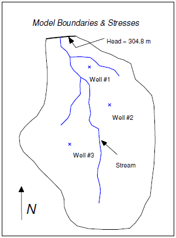
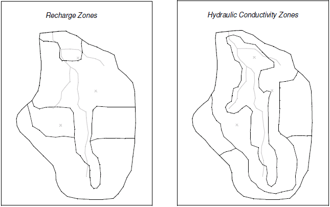

# Model Calibration Basics - Big Valley

For this exercise we will import a previously constructed flow model of the Big Valley site shown in the following diagram:

The basin encompasses 72.5 square kilometers. It is in a semi-arid climate, with average annual precipitation of 0.381 m/yr. Most of this precipitation is lost through evapotranspiration. The recharge which reaches the aquifer eventually drains into a small stream at the center of the basin. This stream drains to the north and eventually empties into a lake with elevation 304.8 m. Three wells in the basin also extract water from the aquifer. The perimeter of the basin is bounded by low permeability crystalline rock. There are ten observation wells in the basin. There is also a stream flow gauge at the bottom end of the stream.

The assumed recharge and hydraulic conductivity zones for the model are shown in the following figure:

The model region encompasses fractured and weathered bedrock as well as alluvial material, grading from hydraulically tighter materials in the south to more permeable materials in the north. Furthermore, the materials around the stream tend to be coarser, cleaner, and thus more permeable. The topmost region of the model near the lake has a high level of phreatophytic plant life. The first task of this exercise will be to import a single layer, unconfined MODFLOW model that has been constructed for the site. This model contains an initial estimate of hydraulic conductivities and recharge. A solution computed with this initial model will then be imported and the error in the initial solution will be analyzed. New values for hydraulic conductivity and/or recharge will then be entered, a new solution will be generated, and a new error estimate will be computed. These steps will be repeated until the error is reasonably small.

Do the following:

1) Go to the Aquaveo tutorial website:

>[<u>http://www.aquaveo.com/software/gms-learning-tutorials</u>](https://byu-ce547.readthedocs.io/en/latest/unit3/03_study_pt3/learning-tutorials.htm)

2) Download and unzip the zip archive associated with the **Model Calibration** tutorial exercise.

3) Download and open the PDF file associated with the **Model Calibration** tutorial exercise.

4) Follow the instructions to complete the tutorial.

 
 