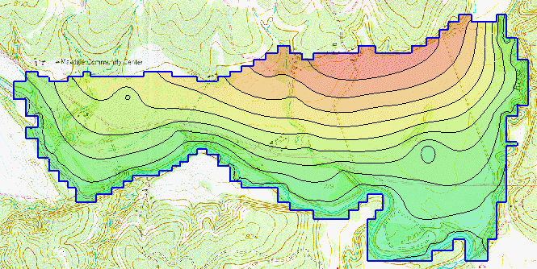
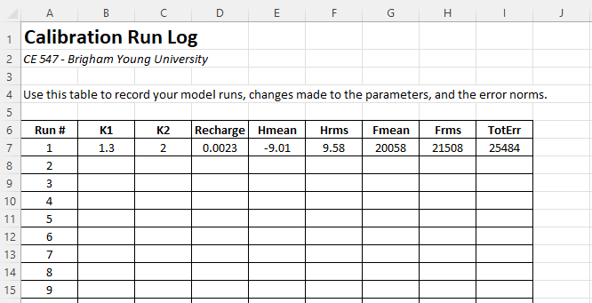

# Homework #10 - Model Calibration

_Note: You may work in pairs on this assignment._

Solve the following problem.

In this exercise we will be first read in a completed MODFLOW model. It is a modified version of the East Texas model (see below). We will then import a set of observation well data and a pair of observed flows. We will then modify the MODFLOW model in an attempt to improve the model calibration.

Before you begin, download the following zip archive:

>>[<u>start.zip</u>](start.zip)

You will need to unzip the files after you download them. Then do the following:

1) Turn on observed flow as one of the properties for the **SourcesSinks** coverage. (Do not confuse with specified flow)

2) Create a single arc group out of all of the specified head arcs along the river at the south end of the model. Assign an observed flow = -28,000 to the arc group. Use an interval corresponding to 5% of the observed flow (enter as a positive value).

3) Assign an observed flow to the specified head arc along the river on the right (east) side of the model. Enter an observed flow of -3400 and an interval corresponding to 5% of this value.

4) Download and open the following spreadsheet of observation well data. Create an observation coverage, turn on the observed heads property, and change the "3D grid layer ..." option to **By layer number**. Import the observation wells to GMS by selecting the table of data in Excel and copying to the clipboard and then selecting Paste in GMS - this will launch the Text Import Wizard. You can also export the Excel file to a *.txt file and use teh File|Open command in GMS. Associate the wells with the top layer.

>>[<u>obs_wells.xlsx</u>](obs_wells.xlsx)

5) Save and run the MODFLOW model. Read in the solution and view your results.

6) Adjust the K values in layers 1 & 2 and the recharge until the model is "calibrated". You will not get a perfect match, but you should be able to get total error norms quite low. Be sure to pay attention to both head and flow error. Before you start your calibration, download and open the following spreadsheet:

>>[<u>run_log.xlsx</u>](run_log.xlsx)

Note that the spreadsheet contains a table with the following columns:

>- Run number
- K1 (k in layer 1)
- K2 (k in layer 2)
- Recharge (big polygon only - don't worry about landfill)
- Hmean (mean head error)
- Hrms (RMS head error)
- Fmean (mean flow error)
- Frms (RMS flow error)
- TotErr (sum of squared weighted residuals)

For each model run you make, enter the values for the run in a new row in the table showing the parameter values and the model results. To see the errors, right-click on the folder containing the solution files and select properties. For example:

Keep improving your model until you get the total error (sum of squared weighted residuals) **less than 100.0.**

You may not use PEST to calibrate the model. This is a manual calibration exercise.

## Submission

Save the GMS project with the completed solution. Zip up all files associated with the project, **including the spreadsheet.** Name your zip folder `calibration_hw.zip` and upload it to Learning Suite.

