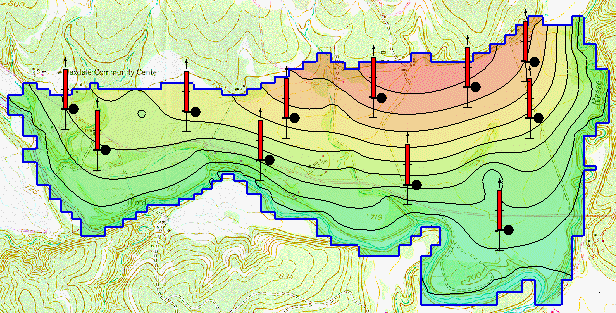

# Homework #11 - Automated Parameter Estimation

_Note: You may work in pairs on this assignment._

Solve the following problems.

In this exercise we will first read in a MODFLOW model corresponding to the previous homework assignment (manual calibration). However, in this case the head and flow observations are already assigned to the model. We will then calibrate the model using PEST.

Before you begin, download the following zip archive:

>>[<u>start.zip</u>](start.zip)

You will need to unzip the files after you download them. Then do the following:

1) Go into the MODFLOW Global Options and set the run option to **parameter estimation** mode.

2) Go to the Map Module and enter key values for the following parameters:

>>Kh in layer 1 
>>Kh in layer 2 
>>Recharge (big polygon - don't worry about landfill)

3) Select the **Map->MODFLOW** command to map your key values to the grid

4) Go to the Parameters dialog in the MODFLOW menu and set up your list of parameters. Enter a starting value and mark the Solve toggle for each of the three parameters. Turn on the log transform option.

5) Save and run the model. Read in the solution and view your results. Compare to your manual solution. Did the PEST solution do better or worse than your manual solution?

6) Open up the *.MTT file and compare the max to min Eigenvalues. Do you think you have a unique solution?

Create a Word document named results.doc to discuss your results for items 5-6.

## Submission

Save the GMS project with the completed solution. Zip up all files associated with the project, **including the Word document.** Name your zip folder `parameter_hw.zip` and upload it to Learning Suite.

