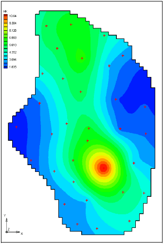
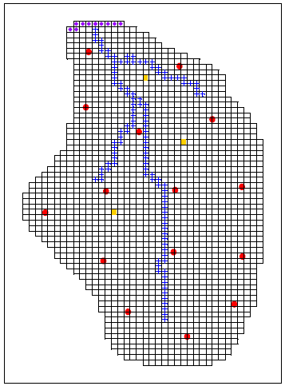

# Automated Parameter Estimation - Pilot Point Method

For this exercise we will run PEST again to solve the same problem from the [<u>previous in-class task</u>](parameter_class_shortcut.url). However, we will use a different method for parameterization. For this problem we will use the zonal approach for recharge, but we will use the pilot point interpolation method for hydraulic conductivity. Pilot points can be thought of as a 2D scatter point set. Instead of creating a zone and having the inverse model estimate one value for the entire zone, the value of the parameter within the zone is interpolated from the pilot points. Then the inverse model estimates the values at the pilot points. Figure 14-1 shows a set of pilot points used to estimate horizontal hydraulic conductivity. Notice how the hydraulic conductivity now varies from cell to cell. When the inverse model runs, the values at the pilot points are adjusted and the “surface” defining the variation of K values is warped until the objective function is minimized.

Do the following:

1) Go to the Aquaveo tutorial website:

&nbsp;&nbsp;&nbsp;&nbsp;&nbsp;&nbsp;&nbsp;&nbsp;[<u>http://www.aquaveo.com/software/gms-learning-tutorials</u>](learning-tutorials.htm)

2) Download and unzip the zip archive associated with the **Pilots Points** tutorial exercise.

3) Download and open the PDF file associated with the **Pilots Points** tutorial exercise.

4) Follow the instructions to complete the tutorial.

5) The tutorial has you use a regular grid to distribute the scatter points. Redo the problem (go back to the start**) using a set of selectively placed points. Use about 15 points. In a normal case, we may use 50 or more points. However, additional points slow down the calibration process and 15 points are adequate to illustrate the process with this particular model. Create your points in approximately the following locations:

_** Note: due to a bug in GMS, you cannot simply create a second scatter point set and point the HK parameter to the new set in the Parameters dialog. GMS gets stuck and cannot link to the new set. So you have to reset GMS, go back to the original start.gpr project file, create a new data set, create the points, etc._

 