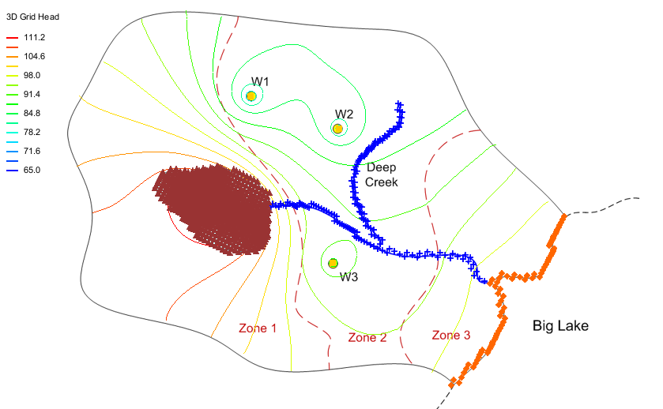

# Particle Tracking with MODPATH - Big Lake

For this exercise we will revisit the Big Lake model. Recall that the model has three wells, a lake in the middle, a river, and a lake on the edge. We will conduct a particle tracking analysis to delineate capture zones for the wells, do forward tracking from the lake, and to learn about particle sets, particle creation, and display options for particle tracking analyses.

Do the following:

1) Right-click here to download the solution to the big lake exercise we did earlier in the semester. Unzip the archive and open in GMS.

>[<u>Big Lake Solution Zip Archive</u>](solution.zip)

2) Go to the **Edit** menu and select the **Model interfaces** command. Turn on the **MODPATH** interface and click OK. (you shouldn't normally have to do this as the MODPATH interface is typically turned on by default).

3) Select the **MODPATH|Generate Particles at Wells** command. Change the number of particles per wells to 30 and click OK.

4) Use the select particles tool in the 3D grid module to explore the travel times for the particles. Note the min/max/average.

5) Double-click on the particle set in the map module. Change the name to **cap zone 10k** and change the travel time to 10,000 days.

6) Experiment with the capture zone display options. Change the **Thin triangle ratio** to 1.0.

7) Right-click on the particle set and duplicate it. Double click on new set and change name to **cap zone 5k** and change travel time to 5000 days.

8) Drag the new capture zone above the first one to change the display order.

9) Change the porosity from **0.3** to **0.15**. What impact does this have on travel time? Why? Change back to **0.3**.

10) Select the **MODPATH|Zone Code Array** command and change the zone code for all of the cells to **5**.

11) Turn off capture zone display, turn on cell edges, and change contours to **linear**. Double click on each of the cells containing the wells and change the zone code to **1**, **2**, and **3**.

12) Go into the **Particles** tab of the **Display Options** dialog and set up custom colors for the zones. Change the pathline color option to **starting code**. This will color pathlines differently for each of the three wells. Turn off cell edges.

13) Right-click on the **Particle Sets** folder and create a new particle set called **lake** and change tracking to **forward**.

14) Go to the map module and select the **source-sink** coverage and select the lake polygon. Right-click and use the **Select intersecting objects** command to select the cells under the lake.

15) Select the **MODPATH|Generate particles at selected cells** command and create one particle per cell at the water table surface. Turn off display of capture zone particle sets.

16) Change the travel time to ten years (3650 days). Do the particles still reach the wells?

17) Change the pathline color option to **ending code**.

18) Play with the travel time value to figure out how long it takes for the first particle from the lake to reach one of the wells.

## Solution

The zip archive associated with the tutorial includes a sample solution to the exercise.

Video: [<u>www.youtube.com/watch?v=Nc1Hwp2N3tI</u>](https://www.youtube.com/watch?v=Nc1Hwp2N3tI)

 
