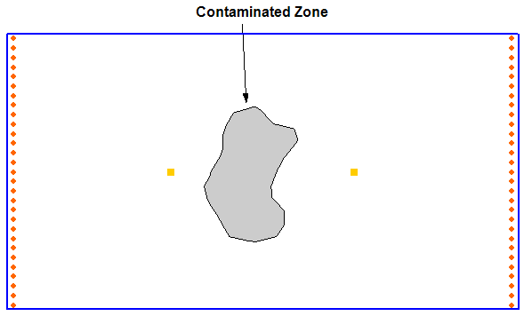

# Homework #13 - Particle Tracking

_Note: You may work in pairs on this assignment._

Solve the following problems. 

In this exercise we will be performing a particle-tracking analysis using MODPATH.

Download the following MODFLOW simulation:

>>[<u>modpstart.zip</u>](modpstart.zip)

You will need to unzip the files after you download them. Then do the following:

1) Start up GMS and read in the MODFLOW simulation.

2) Create a set of particles coincident with the contaminated zone using the **MODPATH|Create Particles at Selected Cells** command. You may wish to use the **Edit|Select with Poly** command to select the cells. Track the particles forward in time. Name the particle set **_"forward from plume"._**

**Q: Are all of the particles captured by the extraction well?**

3) Create a second particle set called **_"injection well"_** and do a forward tracking analysis for the injection well. Use the **MODPATH|Create Particles at Wells** command.

4) Create third particle set called **_"extraction well"_** and do a backward tracking analysis for the extraction well. Once again, use the **MODPATH|Create Particles at Wells** command. 

**Q: What can you conclude about the pathlines for the two cases?**

5) Using the pathlines resulting from the injection well particle set, adjust the pumping rates for the injection and extraction well system until the series of flow lines (i.e., the capture zone) fully encompasses the contaminated zone with a "reasonable" cushion/factor of safety.

## Submission

Save the GMS project with the completed solution. Put your answers to questions 2 & 4 in a Word document. Zip up all files associated with the project, **including the Word doc.** Name your zip folder `particle_hw.zip` and upload it to Learning Suite.

