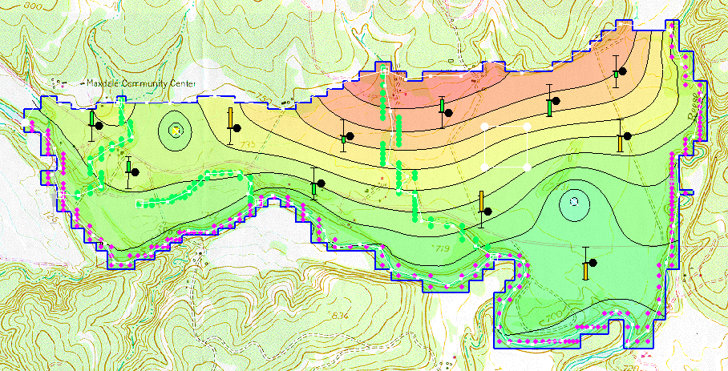

# Homework #14 - Monte Carlo Simulation

_Note: You may work in pairs on this assignment._

Solve the following problem.

In this exercise we will take the MODFLOW model we calibrated for an earlier assignment and perform a Monte Carlo analysis. Before you begin, download and unzip the following archive:

>>[<u>start.zip</u>](start.zip)

Then open the texmod.gpr project inside GMS. You should see the following model:

This project represents a calibrated MODFLOW model with three parameters:

>>1. K for the lower layer 
>>2. K for the upper layer 
>>3. Recharge

Furthermore, the optimal parameter values have already been imported to the parameters dialog to the starting values column.

We will randomize each of the three parameters and perform a Monte Carlo simulation. We will then do a probabilistic capture zone analysis. Do the following:

1) Go into the **MODFLOW Global Options** and change the run option to **Stochastic.**

2) Go to the **Parameters** dialog and turn on the **randomize** option for each of the three parameters.

3) Change the **Stochastic** option to **Latin Hypercube.** Use **four** segments for each of the K parameters and **three** segments for the recharge parameter.

4) Enter a standard deviation of **0.15** for the two K parameters and **0.075** for the recharge parameter.

5) Save the project to as **texmod_stoch.gpr** and run the model. You may notice that some of your model instances will not converge. This is most likely caused by one of the wells going dry in some cases.

6) Read in the results when the solution is complete. Click on several different solutions to view the results.

7) Perform a probabilistic capture zone analysis.

>>a) Right-click on the folder containing the stochastic solutions and select the **Risk Analysis** option.

>>b) Select the **Probabilistic capture zone analysis** option and click **Next**.

>>c) Change the particle placement option so that there are **four** particles per cell.

>>d) Change the tracking duration to **Specified duration** and enter a time of **20,000** days.

>>e) Select the **Stop in cells with weak sinks** option.

>>f) Leave everything else at the default values and select **Finish.** 

>>This process will take several minutes to finish. When the particle tracking process finishes, select the two new data sets at the bottom of the folder containing the stochastic solution to view the results. There will be one data set per well.

>>Note that the capture zones are quite uniform. This is because we only have three parameters and they cover large regions of the model. It is also due to the fact that the standard deviations we used were quite small.

8) Save your results.

Before zipping your solution for uploading, you will need to delete the text output. Go to the subfolder containing your MODFLOW solutions and sort the files by size. You should see a bunch of files with a \*.out suffix (or they may have a \*.glo suffix). Select and delete all of these files (they are just bulky text files generated by MODFLOW). Then zip up your entire project, minus the original **texmod** portion.

## Submission

Save the GMS project with the completed solution. Zip up all files associated with the project.

Name your zip folder `stochastic_hw.zip` and upload it on Learning Suite after we grade it together in class.

## Grading Rubric

Self-grade your assignment using the following rubric. Enter your points in the "Submission notes" section for the assignment on Learning Suite when you upload your file. You can use fractional points if you like (e.g. 2.5).

| Criteria                                    | Points |
|---------------------------------------------|:------:|
| Completed on time and all or mostly correct |   3    |
| Completed more than half of assignment      |   2    |
| Made an effort                              |   1    |
| Did nothing                                 |   0    |
