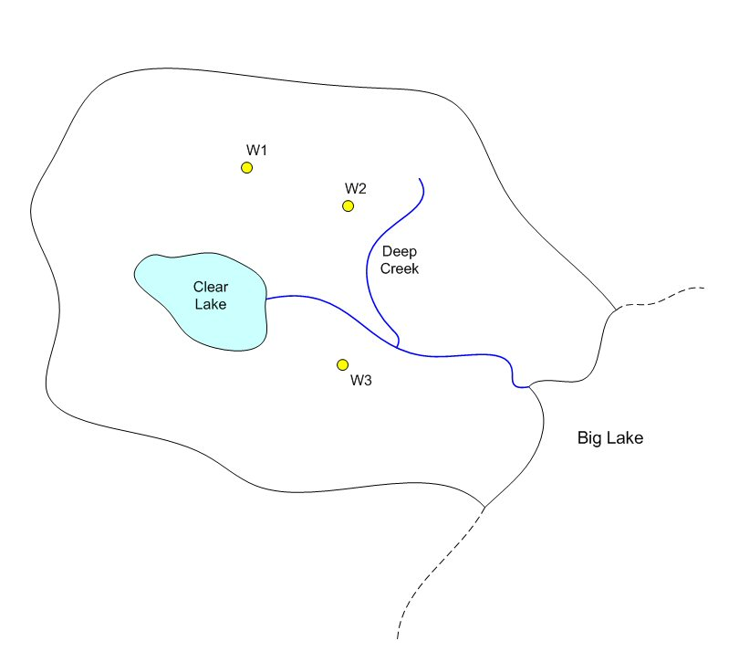

# Homework #15 - Transient Simulation

_Note: You may work in pairs on this assignment._

Solve the following problem.

In this exercise we will start with the big lake model we used in an in-class task and we will convert it to a transient simulation. Here is the site map:

Before you begin, download the following two files:

>>[<u>start2.zip</u>](start2.zip) 
>>[<u>trans_stresses.xlsx</u>](trans_stresses.xlsx)

You will need to unzip the first file after you download it. Then load the project called **biglake2.gpr** into GMS. The project contains a steady state solution. Open the other file in Excel. This spreadsheet contains a summary of the data you will be entering as you convert the model from steady state to transient. Then do the following.

1) Go into the **MODFLOW Global Options** and change the model type to **transient.**

2) Select the **MODFLOW|Output Control** command and turn off the **Save cell-by-cell flow terms to \*.ccf file** and **\*.hff file for transport** options. This will reduce the size of the files you upload when you are finished.

3) Set up a set of stress periods using the information shown in the spreadsheet. Turn off steady state option for first stress period.

4) Copy the heads from the current steady state solution to the **Starting Heads** array. Use the **3D Data Set to -> Grid** command in the **Starting Heads** dialog.

5) Go to the conceptual model and change the **K** coverage so that it includes specific yield as a property. Enter a value of 0.23 for the specific yield for the K polygon.

6) Enter the pumping schedule for the three wells using the data shown in the spreadsheet. Note that the schedules are defined as step functions. Be sure to turn on the Use dates/times toggle in the XY series editor. You should be able to cut and paste the columns of values from the spreadsheet directly into the editor.

7) Enter the transient stresses for the **recharge** polygon and **lake** (general head) polygon using the values shown in the spreadsheet. In this case, the values vary continuously (no step functions).

8) Select the **Map->MODFLOW** command to transform your transient data to the grid.

9) Save and run your model.

10) Read in your solution and select the **Head** data set. Use the **Time Step** window to view the head at selected time steps.

11) Use the **Animate** command in the **Display** menu to generate a movie showing how your heads vary with time. Just accept the default settings. It may take a couple of minutes to generate the animation file. When finished, it will display in a new window. Close the window when finished.

12) Click on the generate plot icon at the top of the GMS window. Select the **Active data set time series** option and select **Finish**. Then use the select cell tool and select different cells in your 3D grid. Note that the head vs. time for the selected cell is plotted in the new window.

13) Save your model.

## Submission

Save the GMS project with the completed solution. Zip up all files associated with the project.

Name your zip folder `simulations_hw.zip` and upload it on Learning Suite after we grade it together in class.

## Grading Rubric

Self-grade your assignment using the following rubric. Enter your points in the "Submission notes" section for the assignment on Learning Suite when you upload your file. You can use fractional points if you like (e.g. 2.5).

| Criteria                                    | Points |
|---------------------------------------------|:------:|
| Completed on time and all or mostly correct |   3    |
| Completed more than half of assignment      |   2    |
| Made an effort                              |   1    |
| Did nothing                                 |   0    |
