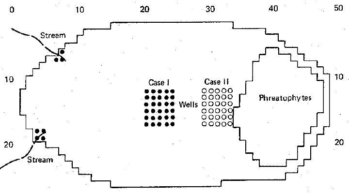
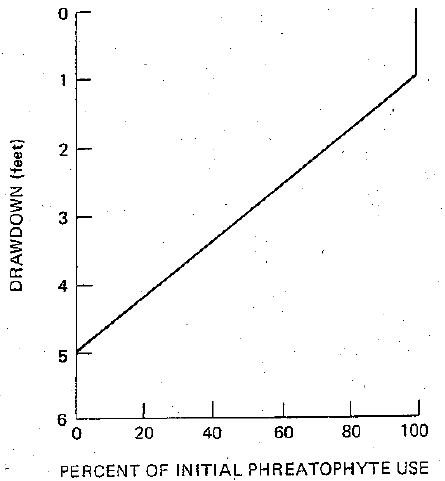
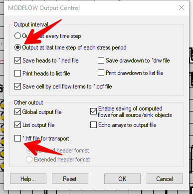
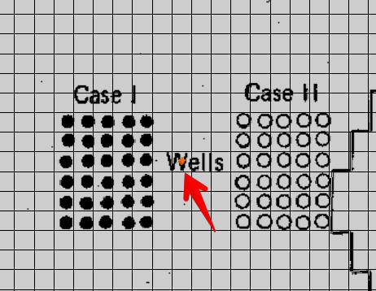
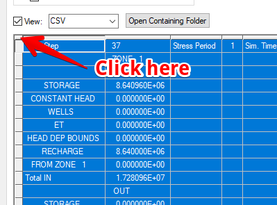
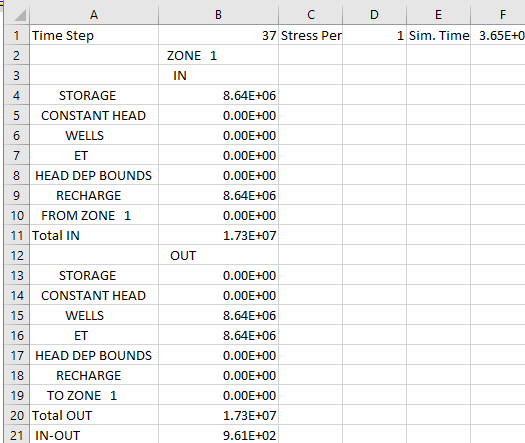

# Homework #16 - Sustainability

_Note: You may work in pairs on this assignment._

Solve the following problem. 

In this exercise we will attempt to reproduce the model used in the famous "water budget myth" paper published by Bredehoeft, et al. in 1982.

>>_Bredehoeft, J. D., S. S. Papadopulos & H. H. J. Cooper, 1982. Groundwater: The Water-Budget Myth Scientific Basis of Water-Resoure Management: Students in Geophyics. National Academy Press, Washington, DC, 51-57._

The model represents a hypothetical unconfined basin aquifer similar to those found in the western United States. The layout of the model is shown here:

The aquifer parameters are as follows:

| Parameter                                                                                               | Value                         |
|---------------------------------------------------------------------------------------------------------|-------------------------------|
| Basin dimensions                                                                                        | 50 x 25 miles                 |
| Hydraulic conductivity                                                                                  | 0.5e-3 ft/sec  42.3 ft/day |
| Storage coefficient (Sy)                                                                                | 0.1                           |
| Saturated thickness                                                                                     | 2000 ft                       | 
| Phreatophytes  &nbsp;&nbsp;&nbsp;&nbsp; Area  &nbsp;&nbsp;&nbsp;&nbsp; Average use (annual)       |  172 mi^2 100 cfs       |
| Recharge (streams)  &nbsp;&nbsp;&nbsp;&nbsp; Area  &nbsp;&nbsp;&nbsp;&nbsp; Average use (annual)  |  7 mi^2 100 cfs         |
| Development (wells)  &nbsp;&nbsp;&nbsp;&nbsp; Area  &nbsp;&nbsp;&nbsp;&nbsp; Average use (annual) |  30 mi^2 100 cfs        |

Prior to development of groundwater withdrawal using wells, the aquifer is in a state of dynamic equilibrium where there is 100 cfs (8,640,000 ft^3/day) of recharge to the system coming primarily from two streams on the western side of the basin. There is a 172 square mile zone of phreatophytes on the eastern side where an equal amount of water (100 cfs) is discharged.

The computational grid has grid cells sized at 1 mi^2 (5280 ft x 5280 ft). The input from the streams is simulated using the Recharge package. The phreatophytes are simulated using the ET package. The model has been initialized to the steady state conditions described in the previous paragraph. The ET package input has been set up so that the ET Surface is equal to the water table surface minus 1 ft and the extinction depth is set to 4 ft. As a result, the ET rate is maximum until the drawdown starts to exceed 1 ft, at which point it linearly decreases over the next 4 ft of drawdown as shown in the following figure:

The objective of this exercise is to consider two pumping scenarios, case 1 and case 2, each with 30 wells in a 5x6 grid, where the total pumping rate for the wells is set to 100 cfs. The theory is that the wells will lower the water table to the point that the ET is fully captured resulting in a new state of equilibrium.

## Building and Running the Models

To begin, use this link to download a copy of the baseline model:

>>[<u>sustain_exercise.zip</u>](sustain_exercise.zip)

The baseline model is a steady state simulation before wells are placed. Unzip the archive and load the model in GMS. You will also need to download this Excel spreadsheet:

>>[<u>wbm_calcs.xlsx</u>](wbm_calcs.xlsx)

Open the spreadsheet and then do the following:

### CASE 1

1) Save a copy of the model as **wbm_case1.gpr**. Save your changes frequently as you work through the next set of steps.

**WARNING:** If you save the simulation on the J: drive, it will take forever for the simulation to complete. If you are in one of the CAEDM labs, save it to the D: drive.

2) Run MODFLOW and read in the resulting solution. Note the head contours.

3) Open the flow budget dialog and examine the components. Note that there is a balance between the Recharge and the ET (other). Note that 100 cfs = 8,640,000 ft^3/day. There is also a small amount of water going to a single specified head cell in the very center of the model. This was necessary to make the steady state model converge when the main sources and sinks are not head-based. We will remove this when we convert the model to transient.

4) Go into the global package and change the model to transient. Open up the Stress Periods dialog and copy-paste the stress period and time step values from the yellow section of the first sheet in the wbm_calcs.xlsx file. Be careful to note the column names - you should highlight/select the cell in the first row in the Length column before you paste the values. Be sure to turn **OFF** the steady state flag for the first stress period. The values in the dialog should looks like the figure below. Note that we are setting up a total simulation time = 400 years (146,000 days). We are using 20 stress periods. None of the inputs will change so we could theoretically use a single stress period with a length = 146,000 days, but we will use 20 stress periods so that we can simplify the model output (see next step).

5) The stress periods you set up result in 14,601 time steps. By default, MODFLOW outputs a set of heads and flows for every time step. We don't need this much data. Open the **Output Control** dialog (select the **MODFLOW|OC - Output Control** command) and change the output interval so that it only saves at the end of each stress period. This will give us 20 output intervals. Also, make sure the output option for the head and flow file (HFF) is **OFF**. Otherwise, your solution files will be about 600MB in size for each solution. After making these changes, the Output Control dialog should look like this:

6) For a transient solution, we need to define a set of storage coefficients, one per cell. Go to the conceptual model and edit the coverage setup for the **aquifer prop** coverage to turn on specific yield. We don't need to enter specific storage because it is a single layer model and all cells will be unconfined. Edit the polygon to assign Sy = **0.1.** Right-click on the **aquifer prop** coverage and map the values to MODFLOW. You must do this **ONLY** for the aquifer prop coverage. If you do it for everything using the general **Map -> MODFLOW** command, you will wipe out the ET surface values which were copied from an array.

7) The steady state simulation required a specified head cell in the middle of the grid to generate a stable solution. For the transient simulation we need to remove it. From the 3D grid module, double-click on the cell shown in this diagram and remove the specified head condition (change **IBOUND** option to **ACTIVE**).

8) Next we need to add the wells for Case 1. Select the cells in the location shown in the basemap and right-click and use the **Sources/Sinks** command to add a well to each of the 30 cells. Calculate the proper pumping rate to allocate **8,640,000** ft3/day among 30 wells.

9) Finally, we need to change solvers. The steady state simulation uses the **PCG2** solver, which is normally a good solver to use by default. However, that solver will not converge with the transient simulation. Go into the Global|Packages dialog and select the **SIP** solver.

10) Save your changes and run the simulation. It should take several minutes to run. Don't panic when it tells you it will take forever to complete. The simulation time estimates are grossly incorrect for some reason. It should take 7-10 minutes or more depending on the computer you are using.

When the simulation completes, read in the solution and look at the results. If everything looks reasonable, continue to build Case 2:

### CASE 2

1) Save a copy of the simulation as **wbm_case2.gpr.**

2) Delete all of the wells in the case 1 location, and recreate them in the case 2 location.

3) Save and run the model again.

## Flow Budget Analysis

Now we are ready to process the results and examine the flow budgets. To do this, we will use some formulas, tables, and charts already set up in the **wbm_calcs.xlsx** workbook. To begin with:

1) Select the **wbm_case1** solution in the project explorer window.

2) In the time step window at the bottom of the project explorer window, click on a time step and then use the up and down arrow keys on your keyboard to view how the head contours change over time.

3) Open the **Flow Budget** dialog and view the overall flow budget for the selected time step.

At this point, we need to analyze the flow budget in more detail. To do that, we will use the USGS ZONEBUDGET utility to process the MODFLOW solution and generate a more detailed flow budget report that we can import to Excel.

4) Click on the **USGS ZONEBUDGET** tab of the Flow Budget dialog.

5) Click on the **Run ZONEBUDGET** button.

6) When the ZONEBUDGET code is finished, close the window and note the new table that appears at the bottom of the window. Click in the small cell in the upper left corner of the table to select the entire label as shown here:

7) Select **Ctrl-C** to copy the table to the clipboard.

8) Go into the **wbm_case1.xlsx** workbook and click on the **zb_case1** tab. Select the upper left cell (A1) and paste the data from the clipboard. After doing so, you should see this:

Scroll through the sheet to examine the data. Note that we have a detailed flow budget for all 20 output time steps.

9) Go back to GMS and select the case 2 solution in the project explorer window. Repeat the above steps to run ZONEBUDGET, copy the budget to the clipboard, and paste the data into the **zb_case2** sheet on the **wbm_calcs.xlsx** workbook.

Now we are ready to view the final flow budget results.

10) Click on the **zb_summary** tab.

Note that there is a table of data and formulas. I have already prepared a set of formulas that reference the data you copied in to the two sheets with zone budget data. The first row represents the baseline conditions at time = 0. Each of the remaining rows list the data for each stress period, and the table lists the time in days and years at the end of the stress period and the ET rates in both ft^3/day and CFS. Note that these rates represent the instantaneous rates at the END of the stress period (corresponding to the time shown). It also lists the rate at which storage is being withdrawn from the aquifer at the same point in time.

The chart shown on the right shows the ET rate vs time for the 400-yr simulation. If you have done everything correctly, the ET rate should be just below 1 cfs for both simulations at the end of the 400-yr period. Note differences in the curves and consider the impact of location on the speed at which the ET is captured. Please note that this curve is on a log scale.

The last part of this exercise is to calculate the total amount of water taken from storage in the two cases (transitional storage). The instantaneous storage withdrawal rates are listed in columns F and J.

11) Fill in the formulas in **G6:G25** and **K6:K25** to compute the volumetric storage withdrawn over each of the 20 stress periods. As you compose your formula, think carefully about the storage withdrawal rates and how you will use these values and the time values to compute the total storage.

12) Create formulas in cells **G28:29** and **K28:K29** to sum the storage values and convert from ft^3 to acre-ft. Recall that one acre-ft = 43,560 ft^3.

Compare the total transitional storage required by the two cases. Why is the case 2 value so much smaller?

## Submission

Create a single zip archive that includes all of your simulation files (wbm_et, wbm_case1, wbm_case2) and the wbm_calcs.xlsx file. For the GMS simulations, be sure to include the MODFLOW files in the subdirectories. To be safe, zip up EVERYTHING in the folder. Name your zip folder `sustainability_hw.zip` and upload it on Learning Suite.

