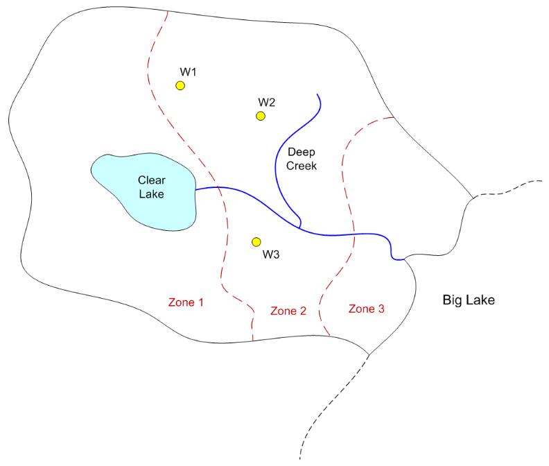

# MODFLOW Modeling with the Python FloPy Package

In this exercise, we will be using the flopy package to build and run some MODFLOW models using Python. 

## Part 1 - Well-Stream Interaction Model

In this exercise, we will build a simple well-stream interaction model using the flopy package. This model is based 
on sample problem illustrated on page 32 of the [USGS Sustainability of Ground-Water Resources (SGWR) Handbook](..
  /13_sustainability/1999%20-%20alley%2C%20reilly%2C%20franke%20%28sustainability%20of%20gw%20resources%29.pdf). 
This example features an aquifer next to a stream as shown below:


Part (A) illustrates the aquifer in a pre-development state. Water enters the aquifer via recharge and exits to the 
stream. Part (B) illustrates the aquifer shortly after the construction of a well near the stream. Initially, the 
well draws water that is entered the aquifer via recharge and it withdraws water from storage in the aquifer. Part 
(C) illustrates the state of the aquifer after the system has come to equilibrium. At this point, the well no longer 
takes water from storage and it pulls water both from aquifer recharge and stream discharge.

We will use the flopy package to build this model and anlyze the evolution of the aquifer over time. We will examine 
how much water is drawn from the aquifer and how much is pulled from the stream vs time. We will also examine the 
total amount of water removed from storage in the time it takes for the system to equilibrate.

You can download a solution to this exercise in GMS/MODFLOW format here: [well_stream.zip](files/well_stream.zip)

Colab Notebook solution: <a href="https://colab.research.google.com/github/njones61/ce547/blob/main/docs/unit3/12_flopy/well_stream.ipynb" target="_blank"></a>

### 1a. Pre-development model.

First we will build the pre-development model where the aquifer is in a steady state condition with recharge as the 
input and stream discharge as the sole output. The model will have the following characteristics:

grid x-dimension: 1000 ft (50 cells)<br>
grid y-dimension: 800 ft (40 cells)<br>
grid z-dimension: 200 ft (1 cell)

Stream: speficied head BC on the right = 150 ft.

K = 1 ft/day<br>
Recharge = 0.01 ft/day

### 1b. Well-stream interaction model (steady state)

Next we will build the well-stream interaction model with a single well located near the stream. We will use a 
steady state model to illustrate the state of the aquifer after the well has been installed and the system has come 
to full equilibrium. 

Well Q = -8000 ft/day<br>
Well location = row 21, column 42, layer 1

We will also examine the total amount of water removed from storage in the time it takes for the system to equilibrate.

### 1c. Well-stream interaction model (transient)

In this case, we will build a transient model where the well draws water from the aquifer and pulls water from the 
stream. We will examine how much water is drawn from the aquifer and how much is pulled from the stream vs time.

Total simulation time: 2000 days<br>
Single stress period with 200 time steps (10 days per time step)<br>
Specific yield = 0.15

We will generated animated gifs showing the evolution of the cone of depression of the well over time. We will also perform a flow budget analysis and plot the rate of storage change and the rate of stream discharge vs. time. 

## Part 2 - Big Lake Model

In this exercise, we will import a MODFLOW model from a GMS file and run it using the flopy package. We will examine the 
output of the model and examine the effect of changing the model parameters. We will be using a copy of the Big Lake 
model that we created earlier this semester [here](../02_regional_models/regional_models_class.md).

{width="600"}

Before we can import the model, there are some things we have to do with the model files. When you save a MODFLOW 
model from GMS, its saves a GMS project file (*.gpr) and then the MODFLOW files are saved to a subfolder within the 
project folder. For example, if you save a model named "my_model" to the folder "C:\my_project", GMS will save teh 
project file and MODFLOW files as:

```
C:\my_project\my_model.gpr
C:\my_project\my_model_MODFLOW\
```
Then the *_MODFLOW folder contains the MODFLOW files. Some of these files are text files that contain information 
about the model, while others are binary files that contain the model data. When GMS writes the MODFLOW files, it 
uses a special binary format (HDF5) to save array data. This format is much more efficient than the text format 
used by MODFLOW. However, flopy does not support reading HDF5 files. Therefore, before we can import the model, we 
have to convert the MODFLOW files to native text files. To do this, we select the MODFLOW|Global menu command to 
bring up the Global Options dialog box. Then we select the following checkbox:


Thenext time we save a MODFLOW model from GMS, it will save the MODFLOW files in native text format. These files 
will be saved in a parallel subfolder as follows:


This set of files can be imported into flopy using the `flopy.modflow.Modflow.load` method.

There is one other change you need to make. One of the MODFLOW input files is called the "name file" and it contains 
a list of all of the other MODFLOW input files. Here is an example of the name file for the Big Lake model:

```aiignore
GLOBAL              701       biglake.glo     #  1. Ftype Nunit Fname [Option]
LIST                702       biglake.out     #  1. Ftype Nunit Fname [Option]
DATA(BINARY)        730       biglake.hed     #  1. Ftype Nunit Fname [Option]
DATA(BINARY)        740       biglake.ccf     #  1. Ftype Nunit Fname [Option]
LMT6                718       biglake.lmt6    #  1. Ftype Nunit Fname [Option]
OBS                 750       biglake.obs     #  1. Ftype Nunit Fname [Option]
RVOB                752       biglake.rvob    #  1. Ftype Nunit Fname [Option]
GBOB                753       biglake.gbob    #  1. Ftype Nunit Fname [Option]
DIS                 719       biglake.dis     #  1. Ftype Nunit Fname [Option]
BAS6                703       biglake.ba6     #  1. Ftype Nunit Fname [Option]
LPF                 704       biglake.lpf     #  1. Ftype Nunit Fname [Option]
OC                  715       biglake.oc      #  1. Ftype Nunit Fname [Option]
RCH                 716       biglake.rch     #  1. Ftype Nunit Fname [Option]
RIV                 708       biglake.riv     #  1. Ftype Nunit Fname [Option]
WEL                 709       biglake.wel     #  1. Ftype Nunit Fname [Option]
GHB                 711       biglake.ghb     #  1. Ftype Nunit Fname [Option]
PCG                 714       biglake.pcg     #  1. Ftype Nunit Fname [Option]
```

When MODFLOW reads the name file, it reads each line and extracts the file name from the line. It then uses the file 
name to find the corresponding MODFLOW input file. 

When you export a MODFLOW model from GMS, it saves the name file with the MODFLOW files with the extension "**\*.mfn**". 
 When you import the model into flopy and then run it, it expects the name file to have the extension "**\*.nam**". Thus, 
you have to rename the name file to "**\*.nam**" before you import the model to FloPy. The following zip archive 
contains the 
Big Lake model with the name file renamed to "**\*.nam**".

Click here to download the Big Lake model in the native format: [big_lake.zip](files/big_lake.zip)

Colab Notebook solution: <a href="https://colab.research.google.com/github/njones61/ce547/blob/main/docs/unit3/12_flopy/biglake.ipynb" target="_blank"></a>

### 2a. Upload and run the model

Run the first few cells to install the required packages and upload the biglake.zip file. Then upload the model and 
view the model inputs and summary. Then run the model and examine the output.

### 2b. Particle Tracking Analysis

In this section will create a set of particles starting at the wells and then track backward in time for a specified 
period of time to delineate capture zones.

### 2c. Flow Budget Analysis

In this section we will examine the flow budget for the model.

### 2d. GHB Conductance Sensitivity Analysis

The biglake model includes a lake that is simulated with the GHB package. In this section we will examine the effect 
of changing the GHB conductance on the amount of water leaking from the lake into the aquifer.

